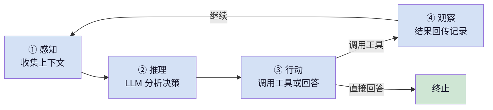
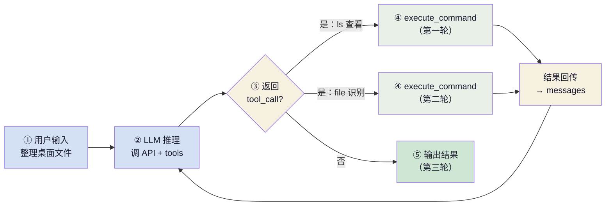

+++
title = "AI 智能体基础（一）：核心循环"
slug = "ai-agent-01-core-loop"
date = 2026-06-13
categories = ["LLM 基础"]
tags = ["AI 智能体"]
draft = false
showToc = true
TocOpen = true
description = "AI 智能体的精确定义、四层架构拆解、感知-推理-行动-观察核心循环的形式化模型、以及最小可运行代码骨架。"
+++

AI 智能体是当前大语言模型应用中最具变革性的范式。它不是给 LLM 套上一层工具调用接口，而是一种全新的计算模型——将 LLM 从被动的文本生成器转变为自主的决策执行者。这篇从第一性原理出发，系统理解 AI 智能体，并给出最小可运行的代码骨架。

---

## 1. 定义与本质

### 1.1 什么是智能体

AI 智能体是一个在环境中自主运行、通过感知获取反馈、利用 LLM 进行推理决策、并通过工具执行动作的循环系统。这个定义包含四个不可或缺的要素：

<div style="padding-left:1.5em">Agent（智能体）= LLM（推理引擎）+ Tool Calling（工具调用）+ Memory（记忆系统）+ Loop（循环控制）</div>

缺少任何一个，系统都不再是完整的智能体：

- 只有 Tool Calling + Memory + Loop，没有 LLM → 能执行但无法推理决策（自动化脚本）
- 只有 LLM + Memory + Loop，没有 Tool Calling → 能推理但无法执行操作（纯聊天机器人）
- 只有 LLM + Tool Calling + Memory，没有 Loop → 能单步但无法循环迭代（单次工具调用）
- 只有 LLM + Tool Calling + Loop，没有 Memory → 能推理执行但无法记住上下文（无状态 API）

### 1.2 与其他范式的区别

| 范式 | 控制流确定时机 | 外部交互 | 状态管理 | 错误恢复 |
|:----:|:-------------:|:--------:|:--------:|:--------:|
| 传统程序 | 编译时 | 直接 API 调用 | 变量/数据库 | try-catch |
| LLM API | / | / | 无状态 | 重试请求 |
| **AI 智能体** | **运行时动态** | **多轮工具调用** | **上下文+记忆** | **LLM 自适应** |

**核心分界线**：在于控制流的确定时机。传统程序的分支路径在代码编写时就已经固定；智能体的控制流由 LLM 在运行时动态决定——每执行一步，观察结果，再根据状态决定下一步走向。

### 1.3 形式化模型

智能体的运行过程可以概括为以下公式：

$$
\begin{aligned}
& \text{状态}_t = (\text{目标任务}, \text{对话历史}_t, \text{可用工具集}) &\quad& \text{当前状态由三部分组成}\\
& \text{动作}_t = \text{LLM}(\text{状态}_t) &\quad& \text{LLM 根据当前状态决定下一步}\\
& \text{结果}_t = \text{执行}(\text{动作}_t) &\quad& \text{执行工具调用，获得观察结果}\\
& \text{历史}_{t+1} = \text{追加}(\text{历史}_t, \text{动作}_t, \text{结果}_t) &\quad& \text{追加决策和结果到历史}
\end{aligned}
$$

终止条件：当 LLM 选择直接回答（而非调用工具），或者循环次数超过最大限制时，Agent 停止运行。

这个模型的核心思想：**智能体的能力来源是 LLM**——给定足够丰富的对话历史，LLM 能输出合理的下一步决策。工程挑战在于如何高效维护对话历史、设计清晰的工具接口，以及控制循环何时终止。

---

## 2. 核心循环详解

### 2.1 四个阶段



**① 感知（Perception）**：Agent 从 messages 列表中读取当前上下文，包括用户输入、历史 tool_call 记录、工具返回结果和系统指令。这是 LLM 理解当前状态并做出决策的唯一依据，感知的完整度直接影响推理质量。

**② 推理（Reasoning）**：LLM 基于当前上下文进行分析和推理，先输出显式的思维过程（Thought），再决策下一步动作——调用工具并传入参数，或直接给出最终回答。推理是 Agent 智能的核心环节。

**③ 行动（Action）**：LLM 输出结构化的动作指令。如果调用工具，指令包含工具名称和参数，由宿主环境解析参数、执行函数并格式化结果。如果终止任务，则直接输出最终文本。

**④ 观察（Observation）**：工具执行完成后，执行结果被格式化为文本追加到 messages 列表，作为下一轮感知的输入。工具结果需要做长度截断、错误信息结构化和敏感数据过滤。

---

## 3. 最小可运行实现

以"整理桌面文件"为场景，分段展示 Agent 核心循环的完整代码。用户输入"帮我整理桌面的文件，统计每种类型的文件数量"，Agent 需要先查看文件列表，再检查文件类型，最后汇总结果。

**第一步：工具函数**——封装操作系统调用

```python
import subprocess

def execute_command(command: str) -> str:
    """执行 shell 命令并返回输出"""
    try:
        result = subprocess.run(
            command, shell=True, capture_output=True,
            text=True, timeout=30
        )
        if result.returncode == 0:
            return result.stdout.strip() or "(命令执行成功，无输出)"
        else:
            return f"执行失败 (code {result.returncode}):\n{result.stderr.strip()}"
    except subprocess.TimeoutExpired:
        return "错误：命令执行超时（>30s）"
    except Exception as e:
        return f"执行异常: {e}"
```

execute_command 封装了 subprocess.run，接收 shell 命令字符串，返回 stdout 内容。设置 30 秒超时防止命令挂死，异常分类处理（超时、非零退出、运行时异常）。read_file 封装文件读取操作，限制 5000 字符输出上限，防止大文件内容撑爆上下文窗口。

---

**第二步：工具注册表**——管理工具定义与分发

```python
from typing import Any, Callable

class ToolRegistry:
    def __init__(self):
        self._schemas: list[dict] = []
        self._handlers: dict[str, Callable] = {}

    def register(self, name: str, description: str,
                 parameters: dict, handler: Callable) -> None:
        self._schemas.append({
            "type": "function",
            "function": {
                "name": name,
                "description": description,
                "parameters": parameters
            }
        })
        self._handlers[name] = handler

    def get_schemas(self) -> list[dict]:
        return self._schemas

    def dispatch(self, name: str, args: dict[str, Any]) -> str:
        handler = self._handlers.get(name)
        if handler is None:
            return f"Error: unknown tool '{name}'"
        try:
            return str(handler(**args))
        except TypeError as e:
            return f"ArgumentError: {e}"
        except Exception as e:
            return f"ExecutionError({type(e).__name__}): {e}"
```

register() 将工具定义分别存入 _schemas 和 _handlers。_schemas 采用 OpenAI Function Calling 格式，作为 tools 参数随每次 LLM 请求发送，使 LLM 感知可用工具及其参数约束；_handlers 维护名称到执行函数的映射，供工具调度使用。dispatch() 根据 LLM 返回的 tool_call 中的工具名，从 _handlers 查找对应函数并调用。异常分类处理：TypeError 返回参数错误提示，其余异常返回错误类型和消息。所有异常中途截获并以字符串形式返回给 LLM，而非抛向调用方，使 LLM 能够根据错误信息自主决定重试或切换策略。

---

**第三步：Agent 运行时**——实现感知-推理-行动-观察循环

```python
from openai import OpenAI
import json

class AgentRuntime:
    def __init__(self, tools: ToolRegistry,
                 system_prompt: str = "你是一个有用的助手。",
                 max_iterations: int = 15):
        self.tools = tools
        self.system_prompt = system_prompt
        self.max_iterations = max_iterations
        self.client = OpenAI()

    def run(self, user_input: str) -> str | None:
        messages = [
            {"role": "system", "content": self.system_prompt},
            {"role": "user", "content": user_input}
        ]

        for step in range(self.max_iterations):
            response = self.client.chat.completions.create(
                model="gpt-4o",
                messages=messages,
                tools=self.tools.get_schemas(),
                tool_choice="auto",
                temperature=0.0
            )
            msg = response.choices[0].message

            if not msg.tool_calls:          # LLM 直接回答 → 终止
                return msg.content

            for tc in msg.tool_calls:       # LLM 调用工具
                args = json.loads(tc.function.arguments)
                result = self.tools.dispatch(tc.function.name, args)
                messages.append(msg)
                messages.append({
                    "role": "tool",
                    "tool_call_id": tc.id,
                    "content": result[:8000]
                })

        return None  # 超过最大步数
```

run() 是 Agent 循环的入口。每次迭代先调用 chat.completions.create()，将当前 messages（对话历史）和 tools（工具 Schema 列表）发送给 LLM。LLM 返回的消息有两种情况：若不含 tool_calls 字段，说明 LLM 认为信息已充足，直接返回消息内容作为最终输出；若含 tool_calls，则遍历每个工具调用请求，通过 dispatch() 执行对应的函数，将返回结果以 role: "tool" 的消息格式追加到 messages 列表尾部，然后进入下一轮迭代。循环在达到 max_iterations 时强制终止。

---

**第四步：组装并运行**——注册工具并启动 Agent

```python
if __name__ == "__main__":
    registry = ToolRegistry()
    registry.register(
        "execute_command",
        "执行 shell 命令，适用于文件操作、程序运行、系统查询等",
        {"type": "object", "properties": {
            "command": {"type": "string", "description": "要执行的 shell 命令"}
        }, "required": ["command"]},
        execute_command
    )
    registry.register(
        "read_file",
        "读取指定文件的内容",
        {"type": "object", "properties": {
            "path": {"type": "string", "description": "文件路径，支持 ~ 开头"}
        }, "required": ["path"]},
        read_file
    )

    agent = AgentRuntime(registry)
    result = agent.run("帮我整理桌面的文件，统计每种类型的文件数量")
    print(result)
```

先实例化 ToolRegistry，分别注册 execute_command 和 read_file 两个工具，包括各自的名称、描述、参数 Schema 和执行函数引用。然后将 registry 传入 AgentRuntime 构造函数，调用 run() 启动循环。Agent 在执行过程中会根据任务需要自动调度两个工具完成文件列表查看、文件类型识别、结果汇总等操作。

### 执行流程

以"整理桌面文件"为例，Agent 的核心循环按以下步骤执行：




---


## 4. 信息论本质

这是理解 Agent 价值最核心的不等式——$H(S_t)$ 表示 $t$ 时刻系统状态的信息熵。每轮循环 Agent 通过工具调用获取外部信息，系统熵值严格递减；当熵值降低到足以回答用户问题时，循环终止：

$$H(S_{t+1}) < H(S_t)$$


以"统计桌面文件类型"为例——LLM 在训练数据中并不知道用户桌面有什么文件，因此初始状态下对此问题完全不确定。每轮工具调用后熵值递减，当信息充足时输出结果，循环终止。

如果去掉循环（即单次 LLM 调用），模型只能靠训练数据中"桌面文件通常有 PDF、图片"这类统计规律来猜测，无法获取用户桌面上的实际文件信息。这就是 Agent 与传统 LLM 调用的本质差异：

| | 单次 API 调用（无循环） | Agent（有循环） |
|:----|:---------------------|:--------------|
| 信息来源 | 仅训练数据（内部知识） | 工具获取外部实时数据 |
| 信息不足 | LLM 编造（幻觉） | 发起工具调用获取缺失信息 |
| 时效性 | 受限于训练截止日期 | 可查询最新数据 |
| 可追溯 | 无法区分事实还是幻觉 | 每轮调用记录可审计 |

Agent 的价值不在于 LLM 本身的能力，而在于**通过循环将外部世界作为动态信息源**，使决策建立在真实数据而非模型记忆之上。没有循环，就没有持续的信息获取能力。

---

## 核心概念速查

| 概念 | 定义 | 关键约束 |
|:----:|:------|:---------|
| Agent | LLM + Tool Calling + Memory + Loop | 四要素缺一不可 |
| 感知 | 从 messages 列表解析当前状态 | 消息完整性决定推理质量 |
| 推理 | LLM 基于上下文输出决策 | 受限于模型能力和上下文质量 |
| 行动 | 执行工具调用或直接回答 | Schema 精度决定调用准确率 |
| 观察 | 工具结果回传并追加上下文 | 需截断超长结果、过滤敏感信息 |
