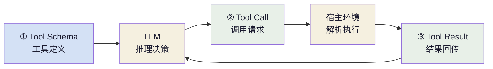

+++
title = "AI 智能体基础（二）：工具调用"
slug = "ai-agent-02-tool-calling"
date = 2026-06-13
categories = ["LLM 基础"]
tags = ["AI 智能体"]
draft = false
showToc = true
TocOpen = true
description = "Tool Calling 协议的完整解析——从协议格式、训练原理到工程实践，深入理解 LLM 如何通过结构化接口与外部世界交互。"
+++

Tool Calling 是智能体与外部世界交互的标准化接口。LLM 通过它发出结构化的函数调用请求，宿主环境负责解析参数、执行函数、回传结果。本文从协议规范出发，通过完整的三轮交互建立直觉，然后系统性地讨论 Schema 设计、错误恢复、Streaming 聚合等工程实践，最后回到训练机制——让读者既理解"LLM 如何学会调用工具"这一底层原理，也能构建可靠的生产级工具调度层。

---

## 1. 定义与定位

### 1.1 在 Agent 体系中的角色

上一篇给出了 Agent 的定义：

<div style="padding-left:1.5em">Agent = LLM（推理引擎）+ Tool Calling（工具调用）+ Memory（记忆系统）+ Loop（循环控制）</div>

Tool Calling 是其中实现**行动（Action）** 环节的关键机制。它解决的核心矛盾是 LLM 输出与可执行指令之间的格式鸿沟：

| | LLM 原始输出 | Agent 执行层需求 |
|:---|:-------------|:-----------------|
| 形式 | 自然语言文本 | 结构化指令（函数名 + 参数） |
| 约束 | 无格式约束 | 必须匹配参数 Schema |
| 可执行性 | 无法直接驱动外部系统 | 可被宿主环境解析并调用 |

Tool Calling 协议在这两者之间建立了一座双向桥梁：LLM 输出特定格式的结构化数据，宿主环境按指令执行函数，再将结果格式化为 LLM 可消费的文本回传。

### 1.2 与传统函数调用的本质差异

传统程序的函数调用链在编译时即确定：

```python
def process_file(path):
    result = read_file(path)      # 调用目标在代码编写时固定
    analysis = analyze(result)     # 调用顺序由开发者编排
    return analysis                # 错误路径由 try-catch 预先规划
```

Tool Calling 则完全不同——调用决策在**运行时由 LLM 动态做出**，决策链路随着上下文变化而实时调整：

| 维度 | 传统函数调用 | Tool Calling |
|:-----|:-------------|:-------------|
| 决策主体 | 开发者 | LLM |
| 决策时机 | 编译时 | 运行时 |
| 调用链路 | 代码中硬编码 | 模型根据上下文动态选择 |
| 参数来源 | 程序状态推导 | LLM 从消息上下文生成 |
| 错误恢复 | 固定异常处理路径 | LLM 自主决定重试或换策略 |

这个差异定义了 Agent 系统的基本架构范式：宿主环境从"调用者"转变为"执行器"，不再承担决策职责，而是精确执行 LLM 下发的指令并回传结果。Tool Calling 的本质正是这一闭环的结构化实现——编码、传输、解码、执行、反馈。

---

## 2. 协议规范

### 2.1 通信模型

Tool Calling 协议定义了三类消息，在每次 LLM API 调用中形成完整的请求-响应闭环：



**Tool Schema** 定义工具的元信息（名称、描述、参数约束），随每次 LLM 请求发送，告知模型当前有哪些工具可用。**Tool Call** 是 LLM 的响应——当它判断需要调用工具时，返回结构化调用指令而非自然语言。**Tool Result** 是执行结果，以独立消息角色回传，作为下一轮推理的上下文。

以下是一个包含工具定义的完整 API 请求体结构，读者可先建立全貌认知，后续各节再逐一拆解每个字段：

```json
{
    "model": "gpt-4o",
    "messages": [
        { "role": "system", "content": "你是一个有用的助手。" },
        { "role": "user", "content": "帮我整理桌面的文件" }
    ],
    "tools": [
        {
            "type": "function",
            "function": {
                "name": "execute_command",
                "description": "执行 shell 命令，适用于文件操作和系统查询",
                "parameters": {
                    "type": "object",
                    "properties": {
                        "command": { "type": "string", "description": "要执行的 shell 命令" }
                    },
                    "required": ["command"]
                }
            }
        }
    ],
    "tool_choice": "auto"
}
```

LLM 判断需要调用工具，返回结构化调用指令而非文字回答：

```json
{
    "choices": [{
        "message": {
            "role": "assistant",
            "content": null,
            "tool_calls": [{
                "id": "call_abc123",
                "type": "function",
                "function": {
                    "name": "execute_command",
                    "arguments": "{\"command\": \"ls /desktop\"}"
                }
            }]
        },
        "finish_reason": "tool_calls"
    }]
}
```

请求中 tools 携带工具定义清单供 LLM 按需选择，tool_choice 控制调用策略，messages 承载对话历史。响应中 content 为 null 表示 LLM 选择调用工具而非回答，finish_reason 为 "tool_calls" 表示停止原因为工具调用。

### 2.2 工具定义（Tool Schema）

每个工具通过一个 JSON 对象定义其接口契约。以下是一个典型示例：

```json
{
    "type": "function",
    "function": {
        "name": "execute_command",
        "description": "执行 shell 命令。适用于文件操作和系统查询。不适用于数学计算。",
        "parameters": {
            "type": "object",
            "properties": {
                "command": {
                    "type": "string",
                    "description": "要执行的 shell 命令，如 ls -la /documents"
                }
            },
            "required": ["command"]
        }
    }
}
```

四个关键字段：

| 字段 | 语义 | 设计要求 |
|:----|:-----|:---------|
| `name` | LLM 引用工具的名称标识 | 语义化命名，全局唯一 |
| `description` | LLM 理解工具用途的唯一来源 | 三段式：功能说明 + 适用场景 + 排除场景 |
| `parameters.properties` | 参数的类型约束与字段描述 | `type` 做格式校验，`description` 指引 LLM 填值 |
| `required` | 必填参数列表 | 非必填越多，LLM 遗漏概率越高 |

### 2.3 调用请求（Tool Call）

LLM 决定调用工具时，响应中 content 为 null，tool_calls 数组包含一个或多个调用请求：

```json
{
    "choices": [{
        "message": {
            "role": "assistant",
            "content": null,
            "tool_calls": [{
                "id": "call_abc123",
                "type": "function",
                "function": {
                    "name": "execute_command",
                    "arguments": "{\"command\": \"ls /documents\"}"
                }
            }]
        },
        "finish_reason": "tool_calls"
    }]
}
```

响应中的三个关键信号：

| 信号 | 取值 | 语义 |
|:----|:-----|:------|
| `content` | `null` | 表示 LLM 调用工具而非文字回答；非 `null` 时循环终止 |
| `tool_calls` | 非空数组 | 本次调用的工具列表；长度 > 1 表示并行调用 |
| `finish_reason` | `"tool_calls"` | 停止原因：`tool_calls` 表示工具调用，`stop` 表示文本回答 |

每个 tool_calls 条目的内部字段：

| 字段 | 语义 | 要求 |
|:----|:------|:------|
| `id` | 服务端生成的调用标识 | 结果回传时需原样携带，用于调用-结果关联 |
| `function.name` | 目标工具名 | 与 Tool Schema 的 `name` 严格一致 |
| `function.arguments` | JSON 字符串编码的参数 | 宿主环境需 `JSON.parse` 解析后调用函数 |

### 2.4 结果回传（Tool Result）

工具执行完成后，结果通过独立消息角色回传：

```json
{
    "role": "tool",
    "tool_call_id": "call_abc123",
    "content": "report.pdf, photo.jpg, notes.txt, script.py"
}
```

| 字段 | 说明 |
|:-----|:------|
| `role: "tool"` | 独立消息角色，与 user / assistant 并列，LLM 据此区分工具回传与用户新输入。 |
| `tool_call_id` | 关联结果至原始调用，并行场景下各条结果通过唯一 ID 一一对应。 |
| `content` | 执行结果以字符串形式返回，建议单条不超过 8000 字符，超长截断并标注省略标记。 |

### 2.5 tool_choice 控制

tool_choice 是请求体顶层参数，与 model、messages、tools 同级，控制 LLM 是否允许以及如何调用工具。提供四种模式：

| 模式 | 行为 | 适用场景 |
|:----:|:-----|:---------|
| `"auto"` | LLM 自主判断是否需要调用工具 | 通用场景，LLM 根据上下文自行判断 |
| `"required"` | LLM 必须调用至少一个工具 | 多步工具链场景，确保 LLM 不会跳过工具直接回答 |
| `"none"` | 禁止调用任何工具 | 纯对话推理阶段，或安全检查环节 |
| 具体工具名 | 强制 LLM 调用指定工具 | 单一用途 Agent，或测试调试 |

"required" 模式的陷阱在于：当所有工具都不适用于当前上下文时，LLM 仍被强制调用工具，参数可能胡编乱造。
应对方式：结合具体工具名模式做兜底——预先注册一个返回空结果的安全工具作为备选，避免 LLM 在无合适工具时随机选择。

---

## 3. 交互流程

以上一篇"整理桌面文件"为例，AgentRuntime 与 LLM API 之间发生三轮请求-响应交互，messages 从 2 条逐步累积至 6 条。

**第一轮：获取文件列表**

请求包含 system prompt 和 user 指令，tools 注册了两个工具：

```json
{
    "model": "gpt-4o",
    "messages": [
        { "role": "system", "content": "你是一个有用的助手。" },
        { "role": "user", "content": "帮我整理桌面的文件，统计每种类型的文件数量" }
    ],
    "tools": [
        {
            "type": "function",
            "function": {
                "name": "execute_command",
                "description": "执行 shell 命令，获取系统信息或操作文件。适用于文件操作、程序运行、系统查询。",
                "parameters": {
                    "type": "object",
                    "properties": {
                        "command": { "type": "string", "description": "要执行的 shell 命令" }
                    },
                    "required": ["command"]
                }
            }
        },
        {
            "type": "function",
            "function": {
                "name": "read_file",
                "description": "读取指定文件的内容",
                "parameters": {
                    "type": "object",
                    "properties": {
                        "path": { "type": "string", "description": "文件路径" }
                    },
                    "required": ["path"]
                }
            }
        }
    ],
    "tool_choice": "auto"
}
```

LLM 返回 content 为 null 的响应，携带 execute_command 调用指令——content 为 null 即调用工具的判据：

```json
{
    "choices": [{
        "message": {
            "role": "assistant",
            "content": null,
            "tool_calls": [{
                "id": "call_001",
                "type": "function",
                "function": {
                    "name": "execute_command",
                    "arguments": "{\"command\": \"ls /desktop\"}"
                }
            }]
        },
        "finish_reason": "tool_calls"
    }]
}
```

AgentRuntime 解析 arguments、执行 ls /desktop，将输出以 role: "tool"、tool_call_id: "call_001" 追加至 messages。

**第二轮：获取文件类型**

messages 累积至四条：system → user → assistant（含 call_001）→ tool（call_001 结果）。LLM 仍需文件类型信息：

```json
{
    "model": "gpt-4o",
    "messages": [
        {
            "role": "system",
            "content": "你是一个有用的助手。"
        },
        {
            "role": "user",
            "content": "帮我整理桌面的文件，统计每种类型的文件数量"
        },
        {
            "role": "assistant",
            "content": null,
            "tool_calls": [
                {
                    "id": "call_001",
                    "type": "function",
                    "function": {
                        "name": "execute_command",
                        "arguments": "{\"command\": \"ls /desktop\"}"
                    }
                }
            ]
        },
        {
            "role": "tool",
            "tool_call_id": "call_001",
            "content": "report.pdf\nphoto.jpg\nnotes.txt\nscript.py"
        }
    ],
    "tools": [
        {
            "type": "function",
            "function": {
                "name": "execute_command",
                "description": "执行 shell 命令",
                "parameters": {
                    "type": "object",
                    "properties": {
                        "command": {
                            "type": "string",
                            "description": "要执行的 shell 命令"
                        }
                    },
                    "required": ["command"]
                }
            }
        },
        {
            "type": "function",
            "function": {
                "name": "read_file",
                "description": "读取指定文件的内容",
                "parameters": {
                    "type": "object",
                    "properties": {
                        "path": {
                            "type": "string",
                            "description": "文件路径"
                        }
                    },
                    "required": ["path"]
                }
            }
        }
    ],
    "tool_choice": "auto"
}
```

content 与 finish_reason 不变，循环继续：

```json
{
    "choices": [{
        "message": {
            "role": "assistant",
            "content": null,
            "tool_calls": [{
                "id": "call_002",
                "type": "function",
                "function": {
                    "name": "execute_command",
                    "arguments": "{\"command\": \"file /desktop/*\"}"
                }
            }]
        },
        "finish_reason": "tool_calls"
    }]
}
```

执行 file /desktop/*，MIME 类型结果以 tool_call_id: "call_002" 追加。

**第三轮：汇总结果**

messages 累积至六条：system → user → tc₁ → r₁ → tc₂ → r₂。信息充足，LLM 直接回答：

```json
{
    "model": "gpt-4o",
    "messages": [
        {
            "role": "system",
            "content": "你是一个有用的助手。"
        },
        {
            "role": "user",
            "content": "帮我整理桌面的文件，统计每种类型的文件数量"
        },
        {
            "role": "assistant",
            "content": null,
            "tool_calls": [
                {
                    "id": "call_001",
                    "type": "function",
                    "function": {
                        "name": "execute_command",
                        "arguments": "{\"command\": \"ls /desktop\"}"
                    }
                }
            ]
        },
        {
            "role": "tool",
            "tool_call_id": "call_001",
            "content": "report.pdf\nphoto.jpg\nnotes.txt\nscript.py"
        },
        {
            "role": "assistant",
            "content": null,
            "tool_calls": [
                {
                    "id": "call_002",
                    "type": "function",
                    "function": {
                        "name": "execute_command",
                        "arguments": "{\"command\": \"file /desktop/*\"}"
                    }
                }
            ]
        },
        {
            "role": "tool",
            "tool_call_id": "call_002",
            "content": "report.pdf: PDF document\nphoto.jpg: JPEG image\nnotes.txt: ASCII text\nscript.py: Python script"
        }
    ],
    "tools": [
        {
            "type": "function",
            "function": {
                "name": "execute_command",
                "description": "执行 shell 命令",
                "parameters": {
                    "type": "object",
                    "properties": {
                        "command": {
                            "type": "string",
                            "description": "要执行的 shell 命令"
                        }
                    },
                    "required": ["command"]
                }
            }
        },
        {
            "type": "function",
            "function": {
                "name": "read_file",
                "description": "读取指定文件的内容",
                "parameters": {
                    "type": "object",
                    "properties": {
                        "path": {
                            "type": "string",
                            "description": "文件路径"
                        }
                    },
                    "required": ["path"]
                }
            }
        }
    ],
    "tool_choice": "auto"
}
```

content 为非 null，finish_reason 为 "stop"——循环终止信号：

```json
{
    "choices": [{
        "message": {
            "role": "assistant",
            "content": "桌面文件共 4 个：PDF 文档 1 个、JPEG 图片 1 个、纯文本 1 个、Python 脚本 1 个"
        },
        "finish_reason": "stop"
    }]
}
```

| 轮次 | messages 数量 | content | finish_reason | LLM 输出 |
|:----:|:-------------:|:-------:|:-------------:|:---------|
| 1 | 2（system + user） | null | tool_calls | `execute_command("ls /desktop")` |
| 2 | 4（+ tc₁ + r₁） | null | tool_calls | `execute_command("file /desktop/*")` |
| 3 | 6（+ tc₂ + r₂） | 非 null | stop | 直接回答文本 |

三轮交互展示了 messages 的累积过程与 content 的终止信号变化。Tool Calling 的三个核心角色（Tool Schema / Tool Call / Tool Result）在这一过程中交替出现，构成了 Agent 循环的行动层。

---

## 4. 工程实践

### 4.1 Schema 设计规范

三条规则：

**语义化命名。** 采用 `动词_名词` 格式，全小写 + 下划线，64 字符以内。命名本身应能暗示工具用途，降低对 description 的依赖。

**description 三段式。** 每个工具的 description 包含三层，依次排列：

```python
description = (
    "执行 shell 命令，获取系统信息或操作文件。"
    "适用于文件操作、程序运行、系统查询。"
    "不适用于数学计算（请使用 calculator 工具）。"
)
```

**参数约束收紧。** 利用 JSON Schema 的 enum、minimum、maximum 等约束缩窄 LLM 的自由度。enum 约束有效性最高——既限值又能避免拼写变体：

```json
{
    "type": "function",
    "function": {
        "name": "service_control",
        "description": "控制服务的启停操作，适用于 systemd 服务管理。",
        "parameters": {
            "type": "object",
            "properties": {
                "action": {
                    "type": "string",
                    "enum": ["start", "stop", "restart"],
                    "description": "要对服务执行的操作"
                },
                "service": {
                    "type": "string",
                    "description": "目标服务名称"
                },
                "timeout": {
                    "type": "integer",
                    "minimum": 1,
                    "maximum": 300,
                    "default": 30,
                    "description": "超时时间（秒）"
                }
            },
            "required": ["action", "service"]
        }
    }
}
```

三条规则对应文章第三节三轮交互中的两个现象：description 的精度决定 LLM 能否选中正确工具；参数约束决定 LLM 能否填对参数。

### 4.2 并行调用

工具间无数据依赖时，LLM 可在单次响应中并行发起多个调用：

```json
{ "tool_calls": [
    { "id": "call_001", "function": {"name": "get_weather", "arguments": "{\"city\": \"北京\"}"} },
    { "id": "call_002", "function": {"name": "get_weather", "arguments": "{\"city\": \"上海\"}"} }
]}
```

约束条件：工具必须无副作用且互相独立（LLM 不保证调用顺序）；结果各发一条 role: "tool" 消息，以 tool_call_id 区分；部分失败时 LLM 下一轮可能只重试失败的那条。

### 4.3 错误恢复

核心原则：**工具执行错误不应抛向宿主环境，应以结构化文本返回给 LLM，由 LLM 决策下一步。**

```python
def dispatch(self, name: str, args: dict) -> str:
    handler = self._handlers.get(name)
    if handler is None:
        return f"Error: unknown tool '{name}'"
    try:
        return str(handler(**args))
    except TypeError as e:
        return f"ArgumentError: {e}"
    except TimeoutError:
        return f"Error: tool timed out (30s)"
    except PermissionError:
        return f"PermissionDenied: insufficient privileges"
    except Exception as e:
        return f"ExecutionError({type(e).__name__}): {e}"
```

错误信息设计三原则：区分可恢复（ArgumentError 可重试）与不可恢复错误（PermissionDenied 应告知用户）；提供足够诊断上下文（超时阈值）；不暴露内部实现细节（栈回溯、文件路径等）。

### 4.4 Streaming 聚合

流式模式下 tool_call 的字段增量按 index 分片传输：

```text
帧 1: delta[tool_calls][0]: {index: 0, id: "call_001", function: {name: "get_weather", arguments: ""}}
帧 2: delta[tool_calls][0]: {index: 0, function: {arguments: "{\"city\": \"北"}}
帧 3: delta[tool_calls][0]: {index: 0, function: {arguments: "京\"}"}}
帧 4: delta[tool_calls][0]: null   ← 该 index 完成
```

聚合逻辑按 index 分组拼接 arguments，**不可在过程中对不完整的 arguments 做部分 JSON 解析**——分片边界可能在 Unicode 字符的 UTF-8 内部，必须等对应 index 的 delta 完成后一次性解析：

```python
def aggregate_tool_calls(deltas):
    calls = {}
    for delta in deltas:
        if not delta.tool_calls:
            continue
        for tc in delta.tool_calls:
            idx = tc.index
            if idx not in calls:
                calls[idx] = {"id": tc.id, "name": tc.function.name, "arguments": ""}
            if tc.function and tc.function.arguments:
                calls[idx]["arguments"] += tc.function.arguments
    return calls
```

---

## 5. 训练机制

Tool Calling 的能力来自训练数据，而非模型的"外挂功能"。LLM 通过有监督微调（SFT）学会在合适的时机输出工具调用格式——训练数据展示"什么时候该调用工具、工具返回值长什么样"，模型在推理时将这种模式泛化到新工具上。

### 5.1 训练数据构造

SFT 训练数据中混合了包含工具调用的对话样本。每个样本的模式相同：assistant 先输出 `[tool_call]` 标签 + JSON 参数，然后接收 tool 角色的执行结果，最后基于结果生成文本回复：

```text
User: 检查一下服务器 web-01 的状态
Assistant: [tool_call] {"name": "check_status", "arguments": {"host": "web-01"}} [/tool_call]
Tool: {"cpu": 45, "memory": 70, "disk": 82}
Assistant: 服务器 web-01 状态正常。CPU 使用率 45%，内存 70%，磁盘 82%。
```

样本有两种来源：人工标注员编写对话剧本；或用 GPT-4 等强模型在预设工具集上运行 Agent 循环，将成功轨迹提取为训练样本。

工具调用样本通常占总 token 数的 5%-15%。比例过低时模型倾向于凭记忆编造答案而非调用工具；比例过高时模型在普通对话中也会莫名输出 `[tool_call]` 格式。

模型学到的是两个层次：**格式记忆**——在 assistant 角色下遇到需外部信息时输出 `[tool_call]` 标签 + JSON；**触发条件**——什么样的上下文意味着需要外部信息。后者远比前者难掌握，也是工具调用召回率的主要瓶颈。

### 5.2 Chat Template 的编码逻辑

训练数据经过 tokenizer 编码后，用特殊标记划分消息角色。以 ChatML 格式为例，序列结构如下：

```text
[im_start]system
你是一个有用的助手。[im_end]
[im_start]user
帮我整理桌面的文件[im_end]
[im_start]assistant
[tool_call]
{"name": "execute_command", "arguments": {"command": "ls /desktop"}}
[/tool_call][im_end]
[im_start]tool
report.pdf, photo.jpg, notes.txt[im_end]
[im_start]assistant
桌面文件共 3 个：PDF 1 份、图片 1 张、文本 1 个[im_end]
```

特殊 token `[im_start]` 和 `[im_end]` 在词表中各占一个独立词元 ID，作用是标记消息的起止边界。

模型在训练中学到的核心规则有三条：

1. 看到 `[im_start]assistant` 时，表示当前说话方是 LLM。如果接下来出现 `[tool_call]`，则切换到工具输出模式，需要生成 JSON 格式的参数。
2. `[tool_call]` 之后必须紧跟一个闭合的 JSON 对象，包含 name（工具名）和 arguments（参数）。这个格式要求通过大量训练样本固化到模型中。
3. 看到 `[im_start]tool` 时，表示当前消息是工具执行结果的回传。模型需要将这条结果与之前的 `[tool_call]` 关联起来，理解它是对上一次调用的反馈。

整个序列——角色标记、tool_call 标签、JSON 参数、tool 回传——作为统一的 next token prediction 任务参与梯度更新。不存在独立的"工具调用模块"被单独训练，模型只是学会了这套格式的 token 序列规律。

### 5.3 工程推论

**推论 1：参数格式越简单，LLM 调用越准。** 嵌套超过三层的 JSON、包含正则表达式的字段、自由格式的 enum 值——这些在训练数据中稀少的模式错误率更高。参数尽量保持扁平 JSON、有限枚举值、短字符串结构。

**推论 2：description 是给工具的 prompt。** 训练时每个工具的 description 字段即参与了模型的注意力计算。推理时传入的 description 本质上是一个附加在每轮请求上的 prompt，告诉模型该工具何时使用、如何使用。描述含糊等于给了模型一个模糊的指令。

**推论 3：JSON 参数生成是 token 续写，不是逻辑计算。** 模型生成 `"arguments": "{\"command\": \"` 时不是在做"参数值计算"，而是在预测最可能的后续 token。这解释了数字边界值、重复字符串、罕见字符为何容易出错——这些模式在训练数据中出现频率低。

**推论 4：tool_call_id 只要求配对，不要求语义。** 训练样本中的 tool_call_id（如 call_xxxx）只是一个配对标记，作用是让模型知道 tool 消息中的 tool_call_id 应当等于 assistant 消息中的 tool_call_id。模型不关心 ID 的具体含义，只学会了两者必须相等。如果宿主编造格式异常的 ID，模型可能无法正确关联结果。

---

## 核心概念速查

| 概念 | 定义 | 边界条件 |
|:----:|:------|:---------|
| Tool Calling | LLM 与外部系统交互的结构化指令协议 | 本质是 SFT 习得的 token 序列生成模式，非独立功能模块 |
| Tool Schema | 工具的名称、描述、参数约束定义 | `description` 是 LLM 理解工具的唯一来源，直接参与推理决策 |
| `content: null` | LLM 选择调用工具而非文本回答的判据 | Agent 循环中以此信号决定是否继续迭代 |
| `finish_reason` | `tool_calls` 表示工具调用截断，`stop` 表示文本回答完成 | 两种状态分别对应循环继续和循环终止 |
| `tool_choice` | 控制 LLM 调用工具权限的参数 | `"auto"` / `"required"` / `"none"` / 具体工具名四种模式 |
| 并行调用 | 单次响应中返回多个互不依赖的 tool_calls | 各工具必须无副作用且独立；LLM 生成时不考虑调用顺序 |
| Streaming 聚合 | 按 index 分组组装分片的 tool_call delta | 不可在聚合过程中对不完整的 arguments 做 JSON 解析 |
