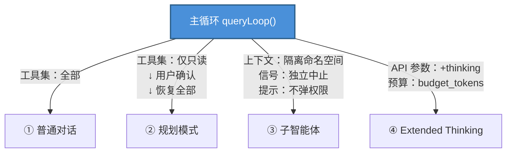
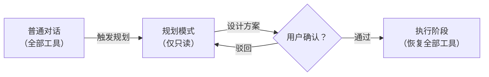
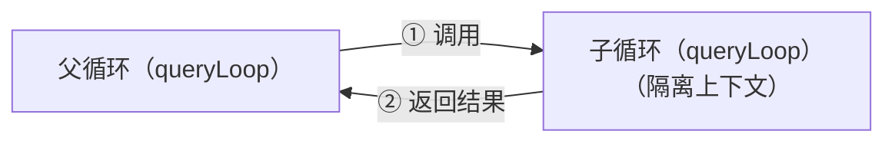

+++
title = "AI 智能体基础（三）：推理模式"
slug = "ai-agent-03-reasoning"
date = 2026-06-14
categories = ["LLM 基础"]
tags = ["AI 智能体"]
draft = false
showToc = true
TocOpen = true
description = "智能体推理模式的形式化定义、CoT/ReAct/Plan-and-Execute/Reflexion 四种主流模式的原理与实现、以及 Claude Code 的实际案例分析。"
+++

推理模式定义了智能体如何利用 LLM 进行决策——是一次成形还是逐步推进，是并行搜索还是反复修正。本文覆盖四种推理模式（CoT / ReAct / Plan-and-Execute / Reflexion），深入原理、实现和工程取舍，最后以先进编码智能体为例进行实际分析。

---

## 1. 定义与定位

### 1.1 推理在智能体架构中的角色

第一篇给出了智能体的四要素公式：

<div style="padding-left:1.5em">Agent = LLM（推理引擎）+ Tool Calling（工具调用）+ Memory（记忆系统）+ Loop（循环控制）</div>

**推理（Reasoning）** 是其中 LLM 引擎的核心工作负载——在感知阶段获取上下文后，LLM 需要综合分析当前状态、规划下一步动作、选择合适工具、生成正确参数。推理的质量直接决定了 Agent 行为的有效性和可靠性。

在感知-推理-行动-观察（P-R-A-O）的四阶段循环中，推理阶段承担两个核心任务：

1. **状态分析**：理解当前 messages 中累积的所有信息（用户输入、历史工具结果、系统指令），识别信息缺口和下一步目标
2. **决策生成**：输出结构化的动作指令——是调用工具（name + arguments）还是直接回答（final answer）

### 1.2 形式化定义

将推理过程建模为一个序列决策问题。设 $C_t$ 为 $t$ 时刻的累积上下文（包括初始指令、历史交互、工具结果），$\mathcal{T}$ 为可用工具集，LLM 的推理函数 $R$ 定义为：

$$
a_t = R(C_t, \mathcal{T}) = \begin{cases}
\text{Call}(f, \theta) & \text{如果 LLM 判断需调用工具 } f \text{，参数为 } \theta \\
\text{Answer}(y) & \text{如果 LLM 判断信息已充足，直接回答 } y
\end{cases}
$$

其中 $C_t$ 随步骤累积：

$$
C_{t+1} = C_t \cup \{(\text{Call}(f_t, \theta_t), \text{Obs}(\text{exec}(f_t, \theta_t)))\}
$$

这里 $\text{exec}(f, \theta)$ 是工具执行函数，$\text{Obs}(\cdot)$ 是观察格式化的函数。

**核心观察**：推理函数 $R$ 的输入 $C_t$ 随步骤不断增长。Agent 推理的本质是**在动态增长的上下文上做序列决策**——每一步都依赖之前所有步骤的累积信息，这是与传统单轮 LLM 调用的根本区别。

### 1.3 两种基本范式

所有推理模式可以归为两种基本范式：

| 范式 | 决策时序 | 代表性的模式 | 关键特征 |
|:----:|:--------:|:------------:|:---------|
| **交错式推理** | 推理-行动-观察交替进行，每步动态决策 | ReAct, Reflexion | 灵活适应环境反馈，但上下文增长快 |
| **批处理式推理** | 先制定完整计划，再按序执行 | Plan-and-Execute, CoT-SC | 执行效率高，可并行，但适应性弱 |

两种范式不是互斥的，实践中常以嵌套或分层方式组合使用。

---

## 2. Chain of Thought（推理链）

Chain of Thought（CoT，Wei et al., 2022）是推理模式的基石。它本身不涉及工具调用，但为所有后续模式提供了核心机制——**将隐式推理过程显式化为中间步骤**。

### 2.1 原理

CoT 的核心思想是让 LLM 在给出最终答案之前，先输出一系列中间推理步骤。在同一道算术题上，标准 Prompt 与 CoT Prompt 的差异如下：

| | 用户提问 | LLM 回答 |
|:--|:--------|:---------|
| **标准 Prompt** | 小明有 3 个苹果，妈妈又给了他 5 个，然后他吃了 2 个，还剩几个？ | 还剩 6 个。 |
| **CoT Prompt** | 小明有 3 个苹果，妈妈又给了他 5 个，然后他吃了 2 个，还剩几个？ | 小明一开始有 3 个苹果。妈妈又给了他 5 个，所以总共有 3+5=8 个。他吃了 2 个，所以还剩 8-2=6 个。答案是 6。 |

对比可以看到：两者用户的提问**完全一样**，区别仅在 LLM 的回答格式。标准 Prompt 直接输出答案，LLM 需要在单步内完成所有隐式推理；CoT Prompt 先输出中间推理步骤再给出答案，将推理过程外部化为显式文本。

### 2.2 Zero-shot CoT

Zero-shot CoT（Kojima et al., 2022）通过在 prompt 末尾附加简单的触发短语来激活推理过程：

```python
def zero_shot_cot(query: str) -> str:
    """Zero-shot Chain of Thought：通过触发词激活推理"""
    client = OpenAI()
    response = client.chat.completions.create(
        model="gpt-4o",
        messages=[
            {"role": "system", "content": "你是一个擅长逐步推理的助手。"},
            {"role": "user", "content": f"{query}\n\n请一步步分析。"}
        ],
        temperature=0.0
    )
    return response.choices[0].message.content
```

"请一步步分析"这句触发词的效果来源于训练数据中的模式匹配——大量训练样本中，类似的提示词后面跟着结构化的推理路径。Kojima et al. 的实验表明，仅凭"Let's think step by step"这一句话，就可在 MultiArith 上将准确率从 ~18% 提升至 ~79%（PaLM 540B），效果几乎与精心构造的 few-shot CoT 示例相当。

### 2.3 Self-Consistency（自一致性）

Self-Consistency（Wang et al., 2022）在 CoT 的基础上引入**采样多样性**，然后通过投票选择最一致的答案：

```python
def self_consistency(query: str, n_samples: int = 5) -> str:
    """Self-Consistency：多次采样 → 多数投票"""
    client = OpenAI()
    responses = []

    for _ in range(n_samples):
        response = client.chat.completions.create(
            model="gpt-4o",
            messages=[
                {"role": "system", "content": "你是一个擅长逐步推理的助手。"},
                {"role": "user", "content": f"{query}\n\n请一步步分析。"}
            ],
            temperature=0.7  # 高温度增加多样性
        )
        responses.append(response.choices[0].message.content)

    # 从每个推理路径中提取最终答案，多数投票
    return majority_vote(responses)
```

Self-Consistency 的核心假设是：正确的推理路径虽然在中间步骤上可能有差异，但最终答案趋于一致；而错误的推理路径则分散在不同的错误答案上。多数投票能有效过滤偏离路径。在 GSM8K 上，Self-Consistency（n=40）将 CoT 的准确率从 ~58% 进一步提升至 ~74%（Wang et al., 2022）——**采样多样性的边际收益随 n 增大而递减**，在 n=5 时已能捕获大部分增益。在 Agent 中，可用于关键决策点：当 LLM 对下一步行动不确定时，多次采样取最一致的计划。

### 2.4 在智能体中的定位

CoT 在 Agent 中的角色是**推理链的格式化工具**。所有后续模式都依赖 CoT 将 LLM 的"思维过程"外部化为文本——没有这个基础，Agent 就无法实现可追溯的决策轨迹。

---

## 3. ReAct（交替推理）

ReAct（Reasoning + Acting，Yao et al., 2023）是目前最主流的 Agent 推理模式。它将推理（Reasoning）和行动（Acting）交错的模式形式化为标准框架。在实验评估中，ReAct 在 HotpotQA 上的准确率达到 58.3%，显著优于单纯使用推理（CoT, 43.6%）或单纯使用行动（Act-only, 48.2%），且幻觉率从 CoT 的 14.3% 降至 6.1%。

### 3.1 原理

ReAct 的核心是让 LLM 在每一轮中依次输出三段信息：

1. **Thought（推理）**：分析当前状态，说明下一步计划做什么、为什么
2. **Action（行动）**：要么调用一个工具（指定名称和参数），要么决定终止
3. **Observation（观察）**：工具执行结果的回传（由宿主环境提供，非 LLM 生成）

```text
Thought: 用户想查询北京今天的天气。我有天气查询工具可用，需要先获取城市代码。
Action: get_city_code("北京")
Observation: 城市代码: BEIJING

Thought: 已获取北京的城市代码，现在查询天气。
Action: get_weather("BEIJING")
Observation: 温度 28°C，晴，湿度 45%

Thought: 信息充足，可以回答用户了。
Action: 北京今天天气晴朗，温度 28°C，湿度 45%。
```

一个完整的 ReAct 轨迹可以表示为：

$$
\text{Thought}_1 \to \text{Action}_1 \to \text{Observation}_1 \to \text{Thought}_2 \to \text{Action}_2 \to \cdots \to \text{Thought}_k \to \text{Final}
$$

序列重复 Thought → Action → Observation 循环，直到 LLM 认为信息充足，以 Thought → Final 终止。

### 3.2 实现

ReAct 的核心循环与第一篇 AgentRuntime.run() 完全一致——都是"LLM 根据 messages 和 tools 做决策 → 有 tool_calls 就执行并回传 → 无 tool_calls 就输出回答"的循环。第一篇的代码即 ReAct 的最小实现（[核心循环 → AgentRuntime 实现](/blog/ai-agent-01-core-loop/#3-%E6%9C%80%E5%B0%8F%E5%8F%AF%E8%BF%90%E8%A1%8C%E5%AE%9E%E7%8E%B0)）。

唯一差别是 ReAct 要求 LLM 先输出 Thought 再决定行动，让推理过程保留在上下文中，多步推理时更连贯。对应第一篇的代码，只需替换 system_prompt：

```python
system_prompt = (
    "你是运行在 ReAct 循环中的智能体。每轮先输出 Thought 说明分析，"
    "再输出 Action 调用工具或直接回答。"
    "信息充足时直接回答，不要过度调用工具。"
    "工具返回错误时尝试其他方式或告知用户。"
)
```

### 3.3 执行轨迹追踪

以"查询北京和上海的天气并比较"为例，ReAct 在三轮交互中逐轮追加消息。最终汇总轮的请求体完整展示了 messages 从 2 条到 6 条的累积过程：

| 轮次 | messages 数量 | content 含 Thought? | finish_reason | LLM 输出 |
|:----:|:-------------:|:------------------:|:-------------:|:---------|
| 1 | 2（system + user） | 有 Thought + Action | tool_calls | get_weather("北京") |
| 2 | 4（+ tc₁ + r₁） | 有 Thought + Action | tool_calls | get_weather("上海") |
| 3 | 6（+ tc₂ + r₂） | 有 Thought + Final | stop | 文本回答 |

```json
{
    "model": "gpt-4o",
    "messages": [
        {"role": "system", "content": "你是一个运行在 ReAct 循环中的智能体。每轮先输出 Thought 分析，再决定行动。"},
        {"role": "user", "content": "查询北京和上海的天气并比较"},
        {
            "role": "assistant",
            "content": "Thought: 用户需要比较北京和上海的天气。我先查询北京的天气。\nAction: get_weather(\"北京\")",
            "tool_calls": [
                {"id": "call_001", "type": "function", "function": {"name": "get_weather", "arguments": "{\"city\": \"北京\"}"}}
            ]
        },
        {"role": "tool", "tool_call_id": "call_001", "content": "{\"temperature\": 28, \"condition\": \"晴\"}"},
        {
            "role": "assistant",
            "content": "Thought: 北京天气已获取：28°C 晴。接下来查询上海天气。\nAction: get_weather(\"上海\")",
            "tool_calls": [
                {"id": "call_002", "type": "function", "function": {"name": "get_weather", "arguments": "{\"city\": \"上海\"}"}}
            ]
        },
        {"role": "tool", "tool_call_id": "call_002", "content": "{\"temperature\": 30, \"condition\": \"多云\"}"}
    ],
    "tools": [
        {"type": "function", "function": {"name": "get_weather", "description": "查询指定城市的天气", "parameters": {"type": "object", "properties": {"city": {"type": "string", "description": "城市名称"}}, "required": ["city"]}}}
    ]
}
```

LLM 看到这 6 条消息后，判定信息充足，返回不含 tool_calls 的最终回答。ReAct 的两层终止信号由此清晰可见：content 中的 Thought/Action 文本在持续增长，但代码层面的判据始终是 msg.tool_calls 是否为 null。Thought 文本虽然不参与循环控制，但为 LLM 保留了上一轮的推理思路，使其在多步决策中保持连贯。

### 3.4 Token 消耗分解

在 ReAct 循环中，token 消耗集中在两类消息上。以下是在上述天气比较任务中的实际分布：

| 消息角色 | 内容 | tokens（约） | 占比 |
|:---------|:-----|:------------:|:----:|
| system prompt | 循环指令 + Thought 格式约束 | 180 | 5% |
| user message | 任务描述 | 20 | <1% |
| tool schemas | 工具定义（每次请求都携带） | 200×3 | 18% |
| assistant (Thought + Action) | "Thought: ... Action: ..." | 80×3 | 7% |
| assistant (tool_calls) | OpenAI 协议中的函数调用形式 | 45×3 | 4% |
| tool results | 查询结果 | 30×2 | 2% |
| **输入累积开销** | 后续请求重复携带之前所有消息 | ~2100 | 63% |

输入累积是 ReAct 中最主要的 token 消耗来源——第 N 轮的请求体包含了前 N-1 轮的全部消息。对于 10 步以上的任务，输入 tokens 以 $O(N^2)$ 增长，远快于输出 tokens 的 $O(N)$。这就是为什么实际部署中必须设置滑动窗口或压缩策略（见 3.6 节）。

### 3.5 Thought 格式设计

Thought 的质量直接决定 ReAct 的效果。好的 Thought 应该包含三类信息：

| 信息类型 | 示例 | 作用 |
|:---------|:-----|:-----|
| **状态认知** | "当前有文件列表数据，但还不知道文件类型" | 帮助 LLM 定位当前进度 |
| **计划说明** | "下一步需要调用 file 命令识别类型" | 让 LLM 形成有序的步骤规划 |
| **异常分析** | "文件打开失败，可能是路径不存在，改用搜索" | 触发 LLM 的错误恢复策略 |

实践中，在 system prompt 中对 Thought 格式做约束比让 LLM 自由发挥更可靠：

```python
system_prompt = """运行在 ReAct 循环中的智能体。

每轮请按以下格式输出：

分析：<分析当前状态——已有什么信息，还缺什么信息>
计划：<说明下一步做什么以及为什么>
行动：<调用工具或直接回答>

注意：
- 如果上一步工具返回了错误，分析错误原因并尝试其他方法
- 获取到足够信息后直接回答，不要继续调用工具
- 回答时引用具体的数据来源"""
```

这个格式有两个作用：对 LLM 是**行为指南**——通过写计划来规划步骤；对人则是**决策日志**——通过 Thought 链回溯 Agent 的决策依据。

### 3.6 上下文累积与截断策略

ReAct 每轮都会在 messages 中追加 assistant 消息和 tool 消息，长任务下上下文会迅速膨胀。需要引入窗口管理：

```python
class SlidingWindowManager:
    """滑动窗口上下文管理器"""

    def __init__(self, max_messages: int = 40, summary_model: str = "gpt-4o-mini"):
        self.max_messages = max_messages
        self.summary_model = summary_model
        self.client = OpenAI()

    def compress(self, messages: list[dict]) -> list[dict]:
        """当消息数超过阈值时，压缩早期的 tool 交互为摘要"""
        if len(messages) <= self.max_messages:
            return messages

        # 保留 system prompt 和最近的 N 条消息
        system = [m for m in messages if m["role"] == "system"]
        recent = messages[-self.max_messages + 2:]  # 保留 + system + 摘要

        # 将早期的 tool 交互汇总为一段摘要文本
        early = messages[len(system):-self.max_messages + 2]
        summary = self._summarize_early_steps(early)

        return system + [
            {"role": "system",
             "content": f"[早期步骤摘要]\n{summary}"}
        ] + recent

    def _summarize_early_steps(self, steps: list[dict]) -> str:
        """调用小模型压缩早期步骤"""
        text = "\n".join(
            f"[{m['role']}]: {str(m.get('content', ''))[:200]}"
            for m in steps
        )
        try:
            resp = self.client.chat.completions.create(
                model=self.summary_model,
                messages=[
                    {"role": "system",
                     "content": "压缩以下 Agent 交互步骤为一段摘要，保留关键信息和结果。"},
                    {"role": "user", "content": text}
                ],
                temperature=0.0
            )
            return resp.choices[0].message.content[:2000]
        except Exception:
            return "(summary unavailable)"
```

关键原则：只压缩早期已完成的工具交互链，不压缩 system prompt 和最近的上下文。压缩不可逆：摘要替换原始日志后，无法回退到压缩前的状态。因此只在上下文长度接近模型限制时触发。

### 3.7 ReAct 的失败模式

| 失败模式 | 表现 | 原因 | 缓解措施 |
|:---------|:-----|:-----|:---------|
| **循环陷阱** | Agent 反复调用同一工具获取相同结果 | LLM 忽略了观察信息中的关键内容 | 添加 dedup 检测，相同结果连续出现 3 次则强制终止 |
| **过早终止** | 信息不充足就给出回答 | LLM 在 token 限制或模糊 prompt 下选择结束 | 降低 temperature，增加"再检查一次"的提示 |
| **推理漂移** | Thought 越来越长，但行动没有实质性进展 | LLM 在上下文噪声中失去对原始目标的聚焦 | 定期在 system prompt 中重申原始任务 |
| **工具依赖固化** | Agent 总是调用同一工具即使不适用 | 工具 description 偏置使 LLM 倾向于简单工具 | 检查并平衡各工具的 description 长度和质量 |

循环陷阱是最常见的失败模式。一个典型的真实案例：Agent 被要求"查找昨天的销售数据"。它调用 search_database("2026-06-13") 返回空结果。Thought 中写"没有数据，再试一次"，下次调用参数完全相同的 search_database——因为 Thought 虽识别了问题，但未能改变 Action 的参数。检测方法：

```python
def detect_loop(history: list[dict], threshold: int = 3) -> bool:
    """检测工具调用循环：相同工具+相同参数连续出现 threshold 次"""
    recent_calls = [
        (tc.function.name, tc.function.arguments)
        for m in history[-10:] if m.get("tool_calls")
        for tc in m["tool_calls"]
    ]
    if len(recent_calls) < threshold:
        return False
    return len(set(recent_calls[-threshold:])) == 1
```

---

## 4. Plan-and-Execute（分解执行）

Plan-and-Execute 将推理分为两个阶段：规划阶段（Plan）由 LLM 一次性制定完整计划，执行阶段（Execute）按计划依次推进。与 ReAct 的"边走边看"不同，它在行动开始前就确定所有步骤。

### 4.1 原理

Plan-and-Execute 将过程分为两阶段。一个完整的 Plan-and-Execute 轨迹可以表示为：

$$
\text{Plan}(\text{task}) \to \big( \text{Execute}(\text{step}_1) \parallel \text{Execute}(\text{step}_2) \big) \to \text{Execute}(\text{step}_3) \to \cdots \to \text{Summarize}
$$

**规划阶段**：LLM 将任务拆解为若干步骤，并标注步骤间的依赖关系。以下以任务"对比 Rust 和 Go 的性能并生成报告"为例：

| 步骤 | 工具 | 参数 | 依赖 |
|:----:|:-----|:-----|:----:|
| Step 0 | search_web | "Rust 性能" | 无 |
| Step 1 | search_web | "Go 性能" | 无 |
| Step 2 | extract_points | step_0 的结果 | [0] |
| Step 3 | extract_points | step_1 的结果 | [1] |
| Step 4 | compare | step_2, step_3 的结果 | [2, 3] |
| Step 5 | summarize | 所有上一步结果 | [4] |

**执行阶段**：按拓扑序执行——无依赖的步骤可并行（$\parallel$），有依赖的等前置完成后再执行：

$$
\text{Execute:} \quad (\text{step}_0 \parallel \text{step}_1) \to (\text{step}_2 \parallel \text{step}_3) \to \text{step}_4 \to \text{step}_5
$$

### 4.2 实现

分三个阶段实现：规划 → DAG 执行 → 自动汇总。

**① 规划**——LLM 将任务拆解为带依赖的步骤列表：

```python
import json


def plan_and_execute(task: str, tools: list[dict],
                     dispatcher: callable,
                     model: str = "gpt-4o") -> str:
    client = OpenAI()

    plan_prompt = (
        "将以下任务拆解为可并行执行的步骤列表。\n\n"
        "每行格式：步骤编号 | 依赖步骤(逗号分隔,无依赖填0) | 工具名 | 参数字典\n\n"
        f"任务：{task}\n\n"
        "要求：\n"
        "1. 无依赖的步骤应编号靠前，以支持并行执行\n"
        "2. 工具名必须从可用工具中选择\n"
        "3. 参数字典中 $step_N 引用第 N 步的结果\n"
        "4. 最后一步（汇总步骤）的工具名填 'summarize'"
    )

    plan_resp = client.chat.completions.create(
        model=model,
        messages=[
            {"role": "system", "content": "你是一个任务规划专家。"},
            {"role": "user", "content": plan_prompt}
        ],
        temperature=0.0
    )
    plan_text = plan_resp.choices[0].message.content
    if not plan_text:
        return "Planning failed: empty plan"

    steps = _parse_plan(plan_text)
    if not steps:
        return "Planning failed: could not parse steps"
```

**② 按 DAG 执行**——多轮调度器，只执行依赖已满足的步骤，检测死锁，失败不阻塞下游：

```python
    results: dict[int, str] = {}
    errors: dict[int, str] = {}
    sorted_steps = sorted(steps, key=lambda s: len(s["depends_on"]))
    remaining = set(s["id"] for s in steps)

    for _round in range(20):
        if not remaining:
            break

        ready = [
            s for s in sorted_steps
            if s["id"] in remaining
            and all(d in results or d in errors for d in s["depends_on"])
        ]
        if not ready:
            for sid in remaining:
                errors[sid] = "Deadlock: dependencies cannot be satisfied"
            break

        for step in ready:
            sid = step["id"]
            failed_deps = [d for d in step["depends_on"] if d in errors]
            if failed_deps:
                errors[sid] = f"Dependency failed: step(s) {failed_deps}"
                remaining.remove(sid)
                continue

            args = _resolve_args(step["args"], results)

            if step["tool"] == "summarize":
                try:
                    summary = client.chat.completions.create(
                        model=model,
                        messages=[
                            {"role": "system",
                             "content": "根据以下执行结果汇总，给出最终回答。"},
                            {"role": "user",
                             "content": f"任务：{task}\n\n执行结果：\n"
                                        f"{json.dumps(results, ensure_ascii=False, indent=2)}"}
                        ],
                        temperature=0.0
                    )
                    results[sid] = summary.choices[0].message.content
                except Exception as e:
                    errors[sid] = f"Summarization failed: {e}"
            else:
                try:
                    result = dispatcher(step["tool"], args)
                    results[sid] = result[:5000] if result else "(empty)"
                except Exception as e:
                    errors[sid] = f"ExecutionError: {e}"
                    if not step.get("critical", False):
                        results[sid] = f"(step {sid} failed: {e})"
            remaining.remove(sid)

    if remaining:
        return (f"Plan incomplete: {len(results)} done, "
                f"{len(errors)} failed, {len(remaining)} unfinished")
```

**③ 自动汇总**——缺少 summarize 步骤时的兜底：

```python
    if not any(s["tool"] == "summarize" for s in steps):
        try:
            summary = client.chat.completions.create(
                model=model,
                messages=[
                    {"role": "system", "content": "汇总执行结果。"},
                    {"role": "user",
                     "content": f"任务：{task}\n\n{json.dumps(results, ensure_ascii=False, indent=2)}"}
                ],
                temperature=0.0
            )
            return summary.choices[0].message.content
        except Exception as e:
            return f"Auto-summarization failed: {e}"

    last_step = max(steps, key=lambda s: s["id"])
    return results.get(last_step["id"], str(results))
```

**辅助函数**——解析 "编号 | 依赖 | 工具 | 参数" 格式，并将 $step_N 替换为实际结果：

```python
def _parse_plan(text: str) -> list[dict]:
    steps = []
    for line in text.strip().split("\n"):
        parts = [p.strip() for p in line.split("|")]
        if len(parts) < 3:
            continue
        try:
            deps = [int(d.strip()) for d in parts[0].split(",")
                    if d.strip() and d.strip() != "0"]
            args = json.loads(parts[2].strip()) or {}
            steps.append({"id": len(steps), "depends_on": deps,
                          "tool": parts[1].strip(), "args": args})
        except (ValueError, json.JSONDecodeError):
            continue
    return steps


def _resolve_args(args: dict, results: dict[int, str]) -> dict:
    resolved = {}
    for k, v in args.items():
        if isinstance(v, str) and v.startswith("$step_"):
            try:
                resolved[k] = results.get(int(v[6:]), v)
            except ValueError:
                resolved[k] = v
        else:
            resolved[k] = v
    return resolved
```

### 4.3 动态重规划

固定计划的弱点在于对执行中出现的异常缺乏适应能力。当某一步失败时，Agent 需要重新规划后续路径：

```python
def replan(failed_step: int, error: str,
           remaining_goal: str, context: dict) -> list[dict]:
    """在步骤执行失败后重新规划剩余任务"""
    client = OpenAI()
    replan_prompt = (
        f"以下步骤执行失败：\n"
        f"步骤 {failed_step} → 错误: {error}\n\n"
        f"已完成步骤的结果：{json.dumps(context, ensure_ascii=False)}\n\n"
        f"剩余目标：{remaining_goal}\n\n"
        f"请提供替代方案来完成剩余目标。"
    )
    resp = client.chat.completions.create(
        model="gpt-4o",
        messages=[{"role": "user", "content": replan_prompt}],
        temperature=0.0
    )
    return _parse_plan(resp.choices[0].message.content or "")
```

重规划的关键是**粒度选择**：整体重规划（放弃当前计划从头来）还是增量重规划（仅替换失败步骤）？整体规划更简单但丢弃已执行成果，增量更高效但需要准确识别可保留的步骤。实践中推荐增量为主，可让 LLM 自行判断："以下步骤执行失败，哪些已完成的结果仍然可用？"

### 4.4 ReAct vs. Plan-and-Execute 的深度对比

| 维度 | ReAct | Plan-and-Execute |
|:-----|:------|:-----------------|
| **决策时机** | 每步动态，利用上一步观察结果 | 规划时一次性确定，执行中静态 |
| **上下文增长** | 快（每条 tool_call + tool_result + Thought 都追加） | 慢（仅执行结果，无中间推理文本） |
| **并行能力** | 无（天然串行） | 有（DAG 拓扑排序，非依赖步骤并行） |
| **适应变化** | 强——每一步都可以根据观察调整方向 | 弱——偏离计划后需要显式重规划 |
| **错误传播** | 单步错误不影响后续步骤的判断 | 一个步骤失败可能导致下游全部中断 |
| **LLM 调用数** | N（步数），每步一次 | 2 + K（1 次规划 + K 次执行/汇总） |
| **适合场景** | 探索型、开放型、路径不确定 | 确定型、可预测、步骤明确的批处理 |
| **成本特征** | 线性：步数越多成本越高 | 前期高（规划）+ 后续低（执行） |

Plan-and-Execute 的优势在步骤可预测的任务中最为明显：网络爬虫（先规划所有页面→并行抓取）、批量数据处理（先规划 ETL 管线→并行执行）、报告生成（先确定报告结构→并行收集各章节数据）。

---

## 5. Reflexion（自我修正）

Reflexion（Shinn et al., 2023）在 ReAct 基础上增加了评价环节：每轮执行完毕后，用另一个 LLM 调用对结果打分，不通过就把失败原因追加到 system prompt 中重新执行。本质上就是 ReAct + 外部评价循环：

$$
\text{Round}_i: \text{ReAct} \to \text{Evaluate} \to \begin{cases}
\text{PASS} & \to \text{Output} \\
\text{FAIL} & \to \text{Round}_{i+1}
\end{cases}
$$

### 5.1 原理

Reflexion 维护一个额外的**反思记忆**（reflexion memory），记录过去执行中的错误和改进策略。每一轮包含三个阶段：

1. **Execution（执行）**：使用 ReAct 模式执行任务
2. **Evaluation（评价）**：LLM 自我评估执行结果的质量
3. **Reflection（反思）**：如果评价不通过，分析失败原因，更新反思记忆

```text
Round 1:
  Execute: 用户要求查询 API → Agent 调用了错误的端点 → 返回错误
  Evaluate: "结果不符合要求，返回值显示 404"
  Reflect: "错误原因是使用了 /v1/legacy 端点，该端点已废弃。应使用 /v2/new"

Round 2:
  Execute: 将反思注入 system prompt → Agent 使用 /v2/new 端点 → 正确
  Evaluate: "结果正确"
  → 结束
```

### 5.2 实现

Reflexion = ReAct + 评价包装。外层循环控制轮次，每轮分三步：

**① 执行**——调用 react_agent，注入历史反思经验：

```python
def reflexion_agent(task: str, tools: list[dict],
                    dispatcher: callable,
                    max_rounds: int = 3,
                    max_steps_per_round: int = 10) -> str:
    client = OpenAI()
    reflexion_memory = []
    history = []

    for round_num in range(max_rounds):
        system_prompt = (
            "你是 ReAct 模式运行的智能体。每轮先输出分析，再决定行动。\n"
            "获取足够信息后直接回答。"
        )
        if reflexion_memory:
            memory_text = "\n".join(
                f"Round {i+1} 反思: {m}"
                for i, m in enumerate(reflexion_memory)
            )
            system_prompt += (
                f"\n\n=== 历史经验 ===\n"
                f"{memory_text}\n"
                f"请在本次执行中避免上述错误。"
            )

        current_result = react_agent(
            task=task, tools=tools,
            dispatcher=dispatcher,
            max_steps=max_steps_per_round
        )
        history.append(current_result)

        if current_result is None:
            reflexion_memory.append(
                "未能在步数限制内完成任务，可能需要更简洁的步骤序列"
            )
            continue
```

**② 评价**——LLM 按标准打分，判定 PASS 或 FAIL：

```python
        eval_prompt = (
            f"任务：{task}\n\n"
            f"Agent 的回答：\n{current_result}\n\n"
            "评价标准：\n"
            "1. 回答是否完整覆盖了任务要求？\n"
            "2. 回答中的数据是否来自工具调用（而非 LLM 编造）？\n"
            "3. 是否有遗漏的步骤或未处理的边缘情况？\n\n"
            "先逐项分析，再在末行输出 PASS 或 FAIL 及其原因。"
        )
        try:
            eval_resp = client.chat.completions.create(
                model="gpt-4o",
                messages=[
                    {"role": "system", "content": "你是一个严格的 Agent 行为评审员。"},
                    {"role": "user", "content": eval_prompt}
                ],
                temperature=0.0
            )
            evaluation = eval_resp.choices[0].message.content
        except Exception:
            return current_result

        if "PASS" in evaluation.upper():
            return current_result
```

**③ 反思**——提取失败原因存入记忆，用于下一轮：

```python
        reflect_prompt = (
            f"任务：{task}\n\n"
            f"Agent 的回答：{current_result}\n\n"
            f"评价意见：{evaluation}\n\n"
            "请分析失败原因并提出具体改进策略用于下一轮。"
        )
        try:
            reflect_resp = client.chat.completions.create(
                model="gpt-4o",
                messages=[{"role": "user", "content": reflect_prompt}],
                temperature=0.0
            )
            reflection = reflect_resp.choices[0].message.content
            reflexion_memory.append(reflection)
        except Exception:
            reflexion_memory.append("发生错误，需检查 API 可用性")

    return history[-1] if history else None
```

### 5.3 评价机制的三种策略

Reflexion 的效果高度依赖评价机制的可靠性。有三种模式可选：

| 策略 | 评价者 | 优点 | 缺点 | 适用场景 |
|:----:|:------:|:-----|:-----|:---------|
| **LLM 自评** | 当前 LLM | 无需额外模型 | 评价与执行共享盲区 | 通用场景 |
| **LLM 评审员** | 独立 LLM（不同配置） | 独立视角，可设不同 system prompt | 成本翻倍 | 质量要求高 |
| **外部评估** | 规则、测试用例、验证器 | 100% 客观，无幻觉 | 需要可量化的评估标准 | 代码生成、数学 |

外部评估是最可靠的方式。在代码生成任务中，通过测试用例评估可以将 Reflexion 的准确率从自评模式的 ~60% 提升至 ~85% 以上（Shinn et al., 2023）。适用于可以自动化验证的场景：

```python
def evaluate_with_tests(response: str, test_cases: list[dict]) -> tuple[bool, str]:
    """通过测试用例评估，适用于代码生成任务"""
    for tc in test_cases:
        try:
            output = execute_code(response, tc["input"])
            if output != tc["expected"]:
                return False, f"Test failed: input={tc['input']}, "
                             f"expected={tc['expected']}, got={output}"
        except Exception as e:
            return False, f"Execution error on {tc['input']}: {e}"
    return True, "All tests passed"
```

### 5.4 收敛性分析

Reflexion 的有效性受评价器质量的直接制约。评价器判对，Reflexion 收敛到正确答案；评价器判错，Reflexion 可能在错误状态终止或陷入死循环。三种典型的不收敛模式：

| 不收敛模式 | 根因 | 缓解方式 |
|:-----------|:-----|:---------|
| **评价者盲区** | 自评模式下 LLM 对自身输出的"盲区评价"准确率仅 50-70%，错误结果可能被错误地判定为 PASS | 使用独立 LLM 评审员或外部评估 |
| **同一错误反复** | 反思被写入 system prompt 末尾，LLM 在长上下文中注意力分散，未能有效吸收 | 将反思紧贴 system prompt 开头，或缩短上下文后再注入 |
| **过度修正** | 为避免错误 A 而走向极端 → 在新方向上犯错 B → 同时避免 A 和 B → 犯错 C | 限制最大轮次，而非让 Agent 无限迭代 |

过度修正在任务上表现为连锁偏移：

```text
Round 1: 错误 A
Round 2: 避免 A → 错误 B
Round 3: 避免 A 和 B → 错误 C
...
```

实践中，设置最大轮次为 2-3 轮即可——Shinn et al. 的实验表明，2 轮 Reflexion 捕获了约 80% 的可修复错误，第 3 轮的边际增益不足 5%。Reflexion 适合捕获偶发错误和边界情况，不适合修复系统性设计缺陷——如果你的 Agent 在第一轮就犯逻辑错误，第三轮大概率也会犯。

---

## 6. 案例分析：Claude Code 的推理架构

基于 v2.1.88 源码分析。Claude Code 的推理架构分为三层：底层是唯一的主循环，中间层是工具系统与上下文管理，上层是模式切换的实现机制。


### 底层：单一主循环

系统仅维持一个主循环，每轮迭代执行统一流程：

**调用模型 → 检查 tool_use →** 有则执行工具并回传继续下一轮，无则输出回答终止。

**循环逻辑恒定，行为差异源于输入控制**。

### 中间层：工具系统与上下文管理

| 机制 | 实现要点 |
|:-----|:---------|
| 工具声明 | 各工具注册时提供文本描述（prompt 方法），动态拼入 system prompt |
| 并行策略 | 只读工具可并行执行，写操作串行，模型可在单轮发起多个独立读取 |
| 上下文压缩 | 消息列表随轮次递增，四层压缩防止超限：自动摘要 → 截断 → 微压缩 → 塌缩 |

### 上层：模式切换

Claude Code 的四种模式共享同一主循环（queryLoop），差异仅在于**主循环的输入参数**不同——循环逻辑本身不变：



四种模式分别来自四个维度的输入控制：

#### ① 普通对话 — 默认模式

模型访问全部注册工具，主循环以最简配置运行。规划、子智能体、Extended Thinking 三种模式均以此为起点，任务完成后也回到此状态。

#### ② 规划模式 — 权限维度

通过**权限标记切换**实现。仅修改了工具的可用范围，循环逻辑不变：



阶段切换由用户把关而非模型自主决定，避免规划不充分即跳入执行。

#### ③ 子智能体 — 上下文维度

在父循环中创建**隔离上下文**，嵌套运行一个完整的 queryLoop，形成嵌套 ReAct。父循环调用子智能体后挂起等待，子循环独立执行完整 queryLoop 后将结果返回，父循环继续执行：



隔离内容（`src/utils/forkedAgent.ts:345`）：

| 隔离项 | 实现 |
|:-------|:-----|
| 文件缓存 | clone(父节点文件缓存) |
| 中止控制 | 独立中止信号 |
| agentId | 随机生成新 ID |
| 权限提示 | 关闭（shouldAvoidPermissionPrompts: true） |

父 Agent 仅见最终结果，子智能体内部推理轨迹完全隔离。

#### ④ Extended Thinking — API 参数维度

Extended Thinking 开启后，LLM 在输出最终回答之前，会先生成一段**内部推理**（模型的"打草稿"过程）。这相当于传统 CoT 中写在回答里的逐步推理，但以独立的数据块回传——类似 DeepSeek 在回答文本中插入的 think 标签，区别在于 API 协议用独立的数据类型而非字符串标签来实现：

- **普通调用**：输入 → 模型直接生成回答（推理过程在模型参数中隐式完成）
- **Thinking 调用**：输入 → 模型先输出 thinking block（推理草稿）→ 再输出 text block（正式回答）

```text
# 有 thinking 时的 Streaming 事件序列
content_block_start → type: "thinking"      ← 模型开始打草稿
content_block_delta → "用户想比较...需要先看..."
content_block_delta → "Rust的核心是所有权..."
content_block_stop
                                             ← 推理阶段结束
content_block_start → type: "text"           ← 开始输出正式回答
content_block_delta → "Rust 和 Go 的..."
content_block_stop
```

两段数据分别以不同事件到达客户端，让 UI 可以独立处理：展示思考过程、或只展示最终回答、或两者并排。区别于传统的 CoT 中推理文本和回答混在同一个响应文本里。

在 API 请求中追加 thinking 参数即开启此功能。从流量侧看，核心变化在请求体中：

```http
POST /v1/messages
Content-Type: application/json

# 无 thinking（普通请求）
{
    "model": "claude-sonnet-4-6",
    "messages": [{"role": "user", "content": "对比 Rust 和 Go 的并发模型"}],
    "max_tokens": 2048
}

# 有 thinking（开启推理）
{
    "model": "claude-sonnet-4-6",
    "messages": [{"role": "user", "content": "对比 Rust 和 Go 的并发模型"}],
    "max_tokens": 2048,
    "thinking": {
        "type": "enabled",
        "budget_tokens": 4096
    }
}
```

多了一个 thinking 参数，其中 budget_tokens 告知 API 为内部推理预留的 token 配额。这个配额不计入 max_tokens——max_tokens=2048 约束的是最终回答的长度，thinking 配额是额外的，按 completion 单价计费。

| 配置 | 请求体中的 thinking 字段 | 行为 |
|:-----|:------------------------|:------|
| `adaptive`（默认） | `{"type": "adaptive"}` | 模型自主决定是否使用 thinking |
| `enabled` + `budgetTokens` | `{"type": "enabled", "budget_tokens": N}` | 强制启用，限定推理预算上限 |
| `disabled` | 不传或传 `null` | 禁用，不产生 thinking 开销 |

子智能体默认关闭以控制成本——嵌套的子智能体调用也开启 thinking 时，token 消耗会叠加。

### 贯穿示例：四种模式的协作流程

以一个常见重构任务为例——"将用户认证从 session 改造为 JWT，补充测试并更新文档，最后提交 MR"。完整执行中依次触发全部四种模式，展示三层架构如何响应多模式切换：

| 阶段 | 触发模式 | 行为 |
|:----:|:---------|:------|
| ① 代码审查 | **普通对话** | 阅读 auth 模块与路由中间件源码，了解当前 session 认证的全貌 |
| ② 迁移规划 | **规划模式** | 限制只读工具，输出 JWT 迁移的分步方案供用户确认 |
| ③ 方案确认 | **普通对话** | 用户审阅方案后确认执行，主循环恢复全部工具权限 |
| ④ 核心实现 | **Extended Thinking** | 编写 token 签发/验证逻辑时启用 thinking，推敲安全边界 |
| ⑤ 并行任务 | **子智能体** | 同时改写路由中间件、更新类型定义、补充单元测试 |
| ⑥ 提交 MR | **普通对话** | 汇总变更、提交 commit、创建 Merge Request |

四种模式在上层通过**不同机制**切换：

| 模式切换 | 触发机制 | 恢复机制 |
|:---------|:---------|:---------|
| 普通对话 ↔ 规划模式 | LLM 主动提议 + 用户确认 | 用户确认后恢复全部工具 |
| 普通对话 → Extended Thinking | thinking 参数阶段性生效 | 同一轮内自动恢复 |
| 普通对话 → 子智能体 | 宿主检测到可并行子任务 | 子循环执行完毕后归并 |

模式切换永远只影响**上层**的参数配置。中间层和底层在同一进程内持续运行，不受模式变更影响——这正是三层架构"解耦循环逻辑与行为控制"的设计目标。

### 错误处理：贯穿全栈的统一策略

无论哪一层出现异常，处理方式一致：基础设施错误（API 调用失败、上下文超限、token 截断）由宿主代码容错重试；工具执行错误（工具不存在、参数校验失败、权限不足、执行异常）全部以 is_error: true 的结果放回消息列表，不做针对性分支处理，由模型在下一轮自行决定恢复策略。宿主代码中没有针对 ModuleNotFoundError 或 PermissionDenied 的特殊分支。错误信息本身即为评价信号，修正由推理自然完成——相比第 5 节的显式 Reflexion，省去了独立的评价阶段和反思记忆。

### 与本文推理模式的对应

| 模式 | Claude Code 实现 | 区别 |
|:-----|:-----------------|:------|
| ReAct | queryLoop，needsFollowUp 控制分支 | 标准 ReAct，无定制分支 |
| Plan-and-Execute | 切换 mode: "plan"，限制只读工具 | 用户确认充当阶段门禁 |
| Reflexion | 工具异常 → is_error: true → LLM 自行恢复 | 隐式容错，无独立反思阶段 |
| CoT | 依赖底层模型能力 | 宿主不干预，依赖模型原生推理 |

### 设计评价

这套三层架构的核心优势在于将"循环逻辑"与"行为控制"解耦。主循环只需关注调用模型与分发工具的标准流程，模式切换和工具管理等变化集中在输入参数层实现。新增模式无需修改循环代码，降低了维护成本与回归风险。

代价是模式间的差异完全隐式地体现在输入参数中（权限标记、嵌套上下文、API 参数），阅读代码时无法在一处看到所有模式的全貌。此外，错误处理完全依赖 LLM 的自我恢复能力，在模型推理质量不稳定时可能引入不可控的行为变异。

---

## 核心概念速查

| 概念 | 定义 | 关键约束 |
|:----:|:------|:---------|
| 推理模式 | Agent 利用 LLM 进行决策的结构化方法 | 模式选择影响 Token 效率、并行度和适应性 |
| Chain of Thought | 将隐式推理外部化为中间步骤 | 基础准确率提升 10-30%（GSM8K），所有 Agent 推理模式的基础 |
| Self-Consistency | 多次采样推理路径 → 多数投票 | 边际收益随 n 递减，n=5 时已捕获大部分增益 |
| ReAct | Thought-Action-Observation 交替循环 | 串行执行，上下文增长快，输入累积呈 O(N²) |
| Plan-and-Execute | 先规划步骤 DAG，再按依赖序执行 | token 效率比 ReAct 高 30-40%，但需要确定性任务 |
| Reflexion | 执行-评价-反思的多轮自修正循环 | 收敛性依赖评价器质量，建议不超过 3 轮 |
