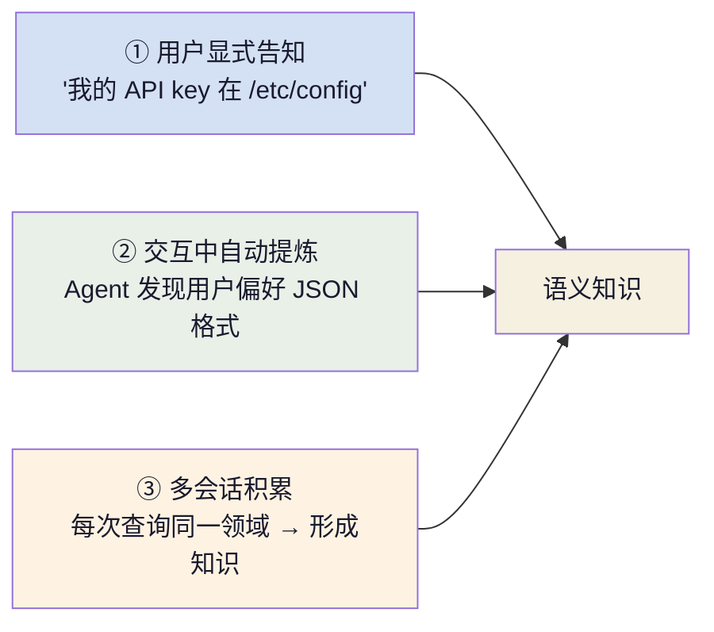

+++
title = "AI 智能体基础（四）：记忆系统"
slug = "ai-agent-04-memory"
date = 2026-06-17
categories = ["LLM 基础"]
tags = ["AI 智能体"]
draft = true
showToc = true
TocOpen = true
description = "智能体记忆系统的完整解析——三层记忆架构（工作/情景/语义）、上下文窗口管理与 Token 预算分配、持久化策略、读写与遗忘机制。"
+++

记忆是智能体四要素公式中最后一个未展开的拼图。前文从核心循环到工具调用再到推理模式建立了 Agent 的骨骼与肌肉，而记忆系统赋予了 Agent **时间感**——它让 Agent 知道自己从哪来、到哪去、已经知道了什么。

没有记忆的 Agent 是失忆的：每轮推理前 messages 中只有当前轮的用户输入，无法回顾上一步的工具结果，更无法从过去的成功或失败中学习。这好比一位每次见面都重新自我介绍的助手——能完成任务，但每一次都是从零开始。

本文从记忆的底层功能出发，建立三层记忆架构的系统理解，然后逐一展开工作记忆的窗口管理、情景记忆的持久化、语义记忆的知识组织，最后给出完整的工程实现模式。

---

## 1. 定义与定位

### 1.1 记忆在智能体架构中的角色

第一篇给出了智能体的四要素公式：

<div style="padding-left:1.5em">Agent = LLM（推理引擎）+ Tool Calling（工具调用）+ Memory（记忆系统）+ Loop（循环控制）</div>

记忆系统在其中扮演的角色可以概括为三个核心功能：

| 功能 | 定义 | 类比 |
|:----|:-----|:------|
| **编码** | 将 LLM 交互过程（输入、推理、工具结果）转换为可存储的表示 | 做笔记 |
| **存储** | 将编码后的信息持久化到合适的存储介质 | 放入书架 |
| **检索** | 在后续推理中找出与当前上下文相关的记忆 | 查笔记 |

这三个功能构成了记忆系统的基本工作循环：Agent 每完成一轮交互，将关键信息编码并存储；下一轮推理开始前，从记忆中检索出对当前决策有帮助的信息，注入上下文窗口。

### 1.2 与数据库、缓存的本质差异

记忆系统不是数据库的封装。虽然它们都涉及数据存储，但存在三个本质区别：

| 维度 | 数据库 | 记忆系统 |
|:-----|:------|:---------|
| **使用者** | 开发者编写的代码（精确查询） | LLM（模糊理解下的语义检索） |
| **查询方式** | SQL / 精确键值 | 自然语言 / 语义向量 / 时间衰减 |
| **数据组织** | 严格 Schema，一致性强 | 松散结构，容忍模糊和遗忘 |
| **生命周期** | 持久化，需显式删除 | 自动压缩、摘要、遗忘 |
| **一致性要求** | 强（ACID） | 弱（摘要可丢失部分细节） |

记忆系统的设计目标是**在信息密度、检索速度和 LLM 理解能力之间寻求平衡**，而非数据完整性。

### 1.3 三元组：编码 → 存储 → 检索

记忆操作的三个基本动作，贯穿所有记忆层级：

```python
class Memory:
    """记忆系统的核心接口"""

    def encode(self, messages: list[dict]) -> MemoryUnit:
        """将交互过程编码为可存储的记忆单元"""
        ...

    def store(self, unit: MemoryUnit) -> str:
        """存储记忆单元，返回记忆 ID"""
        ...

    def retrieve(self, query: str, context: dict) -> list[MemoryUnit]:
        """根据当前上下文检索相关记忆"""
        ...
```

每个具体记忆实现都必须提供这三个操作。编码决定了什么值得被记住，存储决定了记忆的持久程度，检索决定了记忆能否在正确时刻被唤醒。

---

## 2. 三层记忆架构

记忆系统按时间粒度和持久程度划分为三层，形成完整的记忆金字塔：


### 2.1 工作记忆（Working Memory）

**位置**：LLM 的上下文窗口（messages 列表）

**特征**：
- 当前推理时刻可访问的全部信息
- 生命周期与单次 LLM 调用绑定
- 容量由模型上下文长度决定（4K–200K tokens）
- 访问速度最快（纳秒级，内存中）

工作记忆是 Agent 感知的起点——模型能"看到"的唯一信息来源就是上下文窗口中的内容。它包括系统指令、用户输入、历史消息片段、工具 Schema 和当前正在生成的推理文本。

### 2.2 情景记忆（Episodic Memory）

**位置**：本地数据库或文件系统

**特征**：
- 按时间序列组织的完整或摘要会话历史
- 生命周期跨越多次 LLM 调用，通常对应一次任务会话
- 容量为 MB 级
- 访问速度在毫秒级（本地存储）

情景记忆记录 Agent **做过什么、结果如何**。它是工作记忆的"外挂硬盘"——当上下文窗口放不下全部历史时，早期轮次被压缩后存入情景记忆，需要时再取回。

### 2.3 语义记忆（Semantic Memory）

**位置**：外部持久化存储（向量数据库、关系数据库、图数据库）

**特征**：
- 从交互中提取的通用知识和事实
- 生命周期跨会话、跨任务
- 容量为 GB 到 TB 级
- 访问速度在数十毫秒级（网络 I/O）

语义记忆储存 Agent **知道了什么**。区别于情景记忆按时间组织的"流水账"，语义记忆存储的是经过提炼的结构化知识——用户的偏好、领域的事实、过去任务中总结出的规则。

### 2.4 三层之间的流动

数据在这三层之间单向流动：

```
工作记忆 ——（压缩归档）→ 情景记忆 ——（知识提取）→ 语义记忆
     ↑                                              |
     └——————————（检索加载）——————————————————————┘
```

工作记忆满了，部分历史被压缩存入情景记忆；情景记忆积累足够多后，提炼出跨会话的知识写入语义记忆；下次推理开始时，语义记忆和情景记忆中与当前上下文相关的信息被检索出来，重新注入工作记忆。

---

## 3. 工作记忆：上下文窗口管理

工作记忆管理的全部命题可以归结为一句话：**如何在有限的上下文窗口中，最大化 LLM 有效决策所需的信息密度。**

### 3.1 Token 预算分配

以一个 128K 上下文窗口为例，各种信息成分占据不同的比例：


**预算分配的核心原则**：

1. **情景记忆和语义检索占据压缩后的静态预算**（~20%）。历史越长的任务，压缩比例越高，但总预算保持稳定。
2. **系统指令和 Schema 是固定开销**（~4%），不可压缩但需要精心设计以降低长度。
3. **思考区是弹性开销**——ReAct 模式中 Thought 文本越长，可用的推理空间越大，但同时挤占其他内容的预算。
4. **预留至少 10–20% 的可用空间**给 LLM 的生成输出，token 耗尽时模型会截断回答。

### 3.2 四种压缩策略

当消息数量或长度超过阈值时，必须压缩。四种策略在信息损失和执行成本之间存在权衡：

#### ① 截断：最粗暴最常用

直接丢弃最早的消息。实现最简单，但信息损失最大：

```python
def truncate(messages: list[dict], max_messages: int = 40) -> list[dict]:
    """保留最近的 max_messages 条消息，丢弃早期的"""
    system_prompts = [m for m in messages if m["role"] == "system"]
    non_system = [m for m in messages if m["role"] != "system"]
    truncated = non_system[-max_messages + len(system_prompts):]
    return system_prompts + truncated
```

截断只适用于非系统消息。系统消息（role: "system"）携带 Agent 的行为指令，**永远不应被截断**。

#### ② 摘要压缩：用计算量换信息保留

对小模型调用一次 LLM，将早期轮次压缩为一段摘要文本：

```python
class SummaryCompressor:
    """用 LLM 压缩早期交互为摘要"""

    def __init__(self, model: str = "gpt-4o-mini"):
        self.model = model
        self.client = OpenAI()

    def compress(self, messages: list[dict],
                 max_messages: int = 40) -> list[dict]:
        if len(messages) <= max_messages:
            return messages

        system = [m for m in messages if m["role"] == "system"]
        # 保留最近的 80% 预算
        keep = max_messages - len(system)
        recent = messages[-keep:]

        # 对更早的消息做摘要
        early = messages[len(system):-keep]
        summary = self._summarize(early)

        return system + [
            {"role": "system", "content": f"[历史摘要]\n{summary}"}
        ] + recent

    def _summarize(self, steps: list[dict]) -> str:
        text = "\n".join(
            f"[{m['role']}]: {str(m.get('content', ''))[:200]}"
            for m in steps if m.get("content")
        )
        if not text.strip():
            return "(无历史交互)"

        resp = self.client.chat.completions.create(
            model=self.model,
            messages=[
                {"role": "system", "content": (
                    "压缩以下 Agent 交互步骤为一段连贯摘要，"
                    "保留已完成的任务、已获得的关键数据、"
                    "以及未解决的问题。限 500 字以内。"
                )},
                {"role": "user", "content": text}
            ],
            temperature=0.0
        )
        return resp.choices[0].message.content[:2000]
```

摘要压缩的关键在于**压缩 prompt 的设计**：需要明确告知 LLM 保留"已完成的任务"、"已获得的关键数据"和"未解决的问题"三类信息。

#### ③ 渐进压缩：逐级触发的多级策略

不等到达到极限再大幅压缩，而是设定多级阈值，每级采用不同的压缩力度，减少单次压缩的信息暴损：

```python
class ProgressiveCompressor:
    """多级上下文压缩"""

    def __init__(self):
        self.levels = [
            # (消息数阈值, 压缩策略名)
            (50, "summarize"),     # > 50 条：摘要压缩
            (80, "truncate"),      # > 80 条：截断
            (100, "collapse"),     # > 100 条：塌缩（极度压缩）
        ]
        self.client = OpenAI()

    def compress(self, messages: list[dict]) -> list[dict]:
        """按需压缩"""
        n = len(messages)
        for threshold, strategy in self.levels:
            if n <= threshold:
                break
            messages = self._apply(messages, strategy)
        return messages

    def _apply(self, messages: list[dict],
               strategy: str) -> list[dict]:
        match strategy:
            case "summarize":
                return self._summarize(messages)
            case "truncate":
                return self._truncate(messages)
            case "collapse":
                return self._collapse(messages)
```

渐进压缩的进化版本是 Claude Code 采用的**四层压缩策略**（参考第三篇 6.2 节）：自动摘要 → 截断 → 微压缩 → 塌缩。每层触发条件逐级收紧，压缩力度逐级加大。

#### ④ 选择性压缩：只丢弃冗余信息

并非所有消息同等重要。选择性压缩识别并保留高价值信息，只丢弃冗余部分：

| 消息类型 | 保留优先级 | 压缩方式 |
|:---------|:----------:|:---------|
| system prompt | 最高 | 永不压缩 |
| user 任务描述 | 高 | 全文保留 |
| assistant 推理文本（Thought） | 高 | 保留，但要压缩 |
| tool_calls（调用记录） | 中 | 可摘要为操作记录 |
| tool results（执行结果） | 中低 | 只保留核心数据，裁剪冗余 |
| 系统状态通知/日志 | 低 | 优先丢弃 |

### 3.3 窗口管理的边界条件

上下文管理中最容易忽视的是三种边界情况：

**token 精确测量**。消息数不等同于 token 数，一条 2000 字的 tool result 可能消耗 4000 tokens，而 10 条短消息可能只占 200 tokens。精确管理应使用 tokenizer（tiktoken）而非消息计数：

```python
import tiktoken

def estimate_tokens(messages: list[dict], model: str = "gpt-4") -> int:
    """估算消息列表的 token 消耗"""
    enc = tiktoken.encoding_for_model(model)
    n_tokens = 0
    for msg in messages:
        n_tokens += 4  # 每条消息的格式开销
        for key, value in msg.items():
            n_tokens += len(enc.encode(str(value)))
            if key == "name":
                n_tokens -= 1  # name 偏移
    n_tokens += 2  # 回复的格式开销
    return n_tokens
```

**生成退让**。模型生成回答本身也需要消耗 token。如果不预留生成空间，模型会在上下文即将超限时提前截断回答——灾难性时刻。预留量应至少为 `max_tokens × 1.2`。

**上下文边界效应**。窗口末位的信息比头部信息更容易被模型关注到——这是 Transformer 的位置编码带来的局部性。关键信息应放在离当前推理最近的位置，而非窗口开头。

---

## 4. 情景记忆：会话历史持久化

当工作记忆放不下全部会话时，历史交互进入情景记忆。情景记忆解决的是**如何存储和检索过去的交互轨迹**。

### 4.1 组织方式

情景记忆的组织有三种模式，从简到繁：

| 模式 | 存储结构 | 检索方式 | 适用场景 |
|:----|:---------|:---------|:---------|
| **线性日志** | 追加写入的文本记录 | 时间范围查询 | 调试、审计 |
| **分段摘要** | 按时间窗口分段的摘要块 | 关键字匹配 + 时间过滤 | 长会话压缩 |
| **事件索引** | 每条交互标注时间戳 + 类型 + 关键实体 | 结构化查询 | 需要精确回溯 |

**分段摘要是最实用的模式**——在信息保留和检索效率之间取得平衡。实现上以轮次为单位，每 N 轮生成一段摘要：

```python
class EpisodicMemory:
    """基于分段摘要的情景记忆"""

    def __init__(self, storage_path: str, segment_size: int = 5):
        self.path = storage_path
        self.segment_size = segment_size
        self.segments: list[dict] = self._load()
        self.buffer: list[dict] = []
        self.client = OpenAI()

    def append(self, turn: dict):
        """追加一轮交互"""
        self.buffer.append(turn)
        if len(self.buffer) >= self.segment_size:
            self._flush_segment()

    def _flush_segment(self):
        """将缓冲区的 N 轮交互压缩为一段摘要"""
        summary = self._summarize_turns(self.buffer)
        self.segments.append({
            "id": len(self.segments),
            "timestamp": self.buffer[-1].get("timestamp"),
            "summary": summary,
            "turns": len(self.buffer),
            "tools_used": list(set(
                t.get("tool", "") for t in self.buffer
                if t.get("tool")
            )),
        })
        self.buffer = []

    def retrieve(self, context: str, top_k: int = 3) -> list[str]:
        """按相关性检索相关段落"""
        if not self.segments:
            return []

        resp = self.client.chat.completions.create(
            model="gpt-4o-mini",
            messages=[
                {"role": "system", "content": (
                    "以下是 Agent 的历史执行记录摘要列表。"
                    "根据当前任务，选出最相关的 K 个摘要。"
                    "返回格式：每行一个 ID。"
                )},
                {"role": "user", "content": (
                    f"当前任务：{context}\n\n"
                    f"历史摘要：\n" + "\n---\n".join(
                        f"[{s['id']}] {s['summary']}"
                        for s in self.segments
                    )
                )}
            ],
            temperature=0.0
        )
        ids = self._parse_ids(resp.choices[0].message.content or "")
        return [
            self.segments[i]["summary"] for i in ids if i < len(self.segments)
        ][:top_k]
```

### 4.2 遗忘机制

情景记忆如果不加约束，会随着交互增加无限膨胀。遗忘是记忆系统**主动选择信息丢弃**的手段，不是缺陷。

三种遗忘策略：

| 策略 | 行为 | 适用场景 |
|:----|:-----|:---------|
| **时间衰减** | 超过一定时间后自动丢弃 | 时效性强的一轮问答 |
| **轮次限制** | 只保留最近 N 轮 | 工具调用链条较长的任务 |
| **重要性评分** | LLM 对历史打分，低分的丢弃或压缩 | 信息密度不均匀的会话 |

```python
def prune_by_importance(segments: list[dict],
                         max_segments: int = 20) -> list[dict]:
    """按重要性保留最关键的段落"""
    if len(segments) <= max_segments:
        return segments

    # 始终保留最新的段落
    keep = [segments[-1]]

    # 对剩余段落按重要性排序
    candidates = segments[:-1]
    scored = sorted(
        candidates,
        key=lambda s: s.get("importance", 0),
        reverse=True
    )
    keep.extend(scored[:max_segments - 1])
    return sorted(keep, key=lambda s: s["id"])
```

重要性评分可以来自 LLM 对每段交互的事后评价（Reflexion 中的 Evaluation 步骤），也可以简单基于工具调用类型（数据库写入比查询更重要、操作执行比文件读取更重要）。

---

## 5. 语义记忆：知识持久化

语义记忆是 Agent 的"长时知识库"——从交互中提取的事实、偏好、规则，而非交互流水账本身。它与情景记忆的分工可以概括为：

| | 情景记忆 | 语义记忆 |
|:--|:---------|:---------|
| 记录什么 | "昨天我做了一个 X 操作" | "我知道了 X 的配置方法" |
| 组织方式 | 时间序列 | 语义网络 |
| 跨会话 | 不明显 | 主要用途 |
| 遗忘后 | 丢失操作细节 | 丢失知识 |

### 5.1 知识获取

语义记忆的知识来源有三种方式：



自动提炼是一个典型的"编码"问题——什么时候一段交互经验值得被存入语义记忆？两个判断标准：

1. **可重复性**：这条信息在将来类似场景中是否有可能被再次需要？
2. **跨场景性**：这条信息是否独立于当前任务语境？

满足任意一条即可存入。用户的命名偏好满足两者，当前文件查询结果两条都不满足。

### 5.2 存储模式

语义记忆的存储有三种主流模式，对应不同的检索方式和数据特性：

| 模式 | 存储介质 | 检索方式 | 适合数据类型 |
|:----|:---------|:---------|:------------|
| **向量存储** | Chroma / Pinecone / Qdrant | 语义最近邻搜索 | 非结构化文本、配置说明、描述 |
| **结构化存储** | SQLite / PostgreSQL | 精确键值 / SQL 查询 | 事实、偏好键值对、元数据 |
| **图存储** | Neo4j / Dgraph | 图遍历 / 路径查询 | 实体关系、多跳关联知识 |

**向量存储**是最广泛采用的模式，因为它与 LLM 的语义理解能力天然契合。但它的检索质量高度依赖嵌入模型的质量和 chunk 策略：

```python
class SemanticMemory:
    """基于向量检索的语义记忆"""

    def __init__(self, collection_name: str = "agent_memory"):
        import chromadb
        self.client = chromadb.PersistentClient(
            path="/path/to/chroma"
        )
        self.collection = self.client.get_or_create_collection(
            name=collection_name,
            metadata={"hnsw:space": "cosine"}
        )

    def add(self, content: str, metadata: dict = None):
        """添加一条知识"""
        self.collection.add(
            documents=[content],
            metadatas=[metadata or {}],
            ids=[f"mem_{hash(content)}"]
        )

    def query(self, question: str, top_k: int = 3) -> list[str]:
        """检索相关知识"""
        results = self.collection.query(
            query_texts=[question],
            n_results=top_k
        )
        return results["documents"][0] if results["documents"] else []
```

### 5.3 与 RAG 的协作边界

语义记忆与 RAG（ Retrieval-Augmented Generation）共享技术栈（都用到向量检索），但定位不同：

**RAG** 面向 Agent 外部的文档知识库。Agent 不拥有这些知识，它们由业务系统维护、被多个 Agent 共享、只读不写。

**语义记忆** 面向 Agent 自身的经验知识。由 Agent 写入、向 Agent 自身提供服务、可更新可修正。

两者的关系是互补而非重叠：RAG 提供**领域知识**，语义记忆提供**经验知识**。一篇技术文档通过 RAG 检索，但"上次调试时发现这个参数需要 double 类型"这条经验通过语义记忆存储。

实践中，**不推荐**让 Agent 在运行时同时检索 RAG 和语义记忆后混入同一窗口——两种知识的来源和置信度不同。更清晰的方案是分段注入，并用不同 system prompt 约束 LLM 对两类知识的引用方式：

```python
def inject_knowledge(messages: list[dict],
                     rag_results: list[str],
                     memory_results: list[str]) -> list[dict]:
    """将 RAG 和语义记忆分段注入上下文"""
    knowledge_block = ""
    if rag_results:
        knowledge_block += (
            "【参考文档】\n" +
            "\n\n".join(rag_results) + "\n\n"
        )
    if memory_results:
        knowledge_block += (
            "【历史经验】\n" +
            "\n\n".join(memory_results)
        )
    if knowledge_block:
        messages.insert(1, {
            "role": "system",
            "content": knowledge_block.strip()
        })
    return messages
```

---

## 6. 记忆系统的工程模式

### 6.1 记忆管理器接口

将三层记忆统一在一个管理器下，对外提供一致的读写接口，对内负责三层之间的数据流转：

```python
class MemoryManager:
    """统一的记忆系统管理器"""

    def __init__(self, config: dict):
        self.working_limit = config.get("max_context", 128_000)
        self.episodic = EpisodicMemory(
            path=config.get("episodic_path", "./memory/episodic")
        )
        self.semantic = SemanticMemory(
            collection_name=config.get("collection", "agent_memory")
        )
        self.compressor = ProgressiveCompressor()
        self.token_counter = tiktoken.encoding_for_model(
            config.get("model", "gpt-4")
        )

    def on_turn_complete(self, messages: list[dict],
                          turn: dict):
        """每轮交互结束时的记忆处理"""
        # 1. 写入情景记忆
        self.episodic.append(turn)

        # 2. 如果上下文接近极限，压缩工作记忆
        if self._estimate_tokens(messages) > self.working_limit * 0.85:
            return self.compressor.compress(messages)

        return messages

    def on_session_start(self, context: str) -> list[dict]:
        """新一轮开始时，注入相关记忆"""
        memory_injections = []

        # 检索情景记忆
        episodic = self.episodic.retrieve(context)
        memory_injections.extend(episodic)

        # 检索语义记忆
        semantic = self.semantic.query(context)
        memory_injections.extend(semantic)

        return memory_injections

    def on_session_end(self):
        """会话结束时，将情景记忆提炼为语义记忆"""
        for segment in self.episodic.segments:
            # 提取跨会话可复用的知识
            knowledge = self._extract_knowledge(segment["summary"])
            if knowledge:
                self.semantic.add(knowledge, {
                    "source": f"segment_{segment['id']}",
                    "timestamp": segment["timestamp"]
                })

    def _extract_knowledge(self, text: str) -> str | None:
        """从历史摘要中提取可复用的知识"""
        resp = self.client.chat.completions.create(
            model="gpt-4o-mini",
            messages=[
                {"role": "system", "content": (
                    "从以下 Agent 交互摘要中提取可复用的知识。"
                    "只提取满足以下所有条件的知识：\n"
                    "1. 独立于当前任务语境\n"
                    "2. 在未来类似场景中可能有用\n"
                    "3. 是事实性信息而非临时决策\n\n"
                    "如果没有可提取的知识，输出 [无]"
                )},
                {"role": "user", "content": text}
            ],
            temperature=0.0
        )
        result = resp.choices[0].message.content
        return None if result == "[无]" else result
```

### 6.2 读写路径与缓存

记忆系统最常见的性能瓶颈是**写路径阻塞推理**。如果在每轮 tool result 回传后都同步写入情景记忆，推理循环会被迫等待 I/O：

```text
# 不好的模式：同步写入阻塞推理
推理 → 工具执行 → 写记忆 → 等待 I/O → 下一轮推理
                                        ↑ 记忆还没写完？等着
```

更好的模式是**写路径异步化，读路径缓存化**：

```text
# 好的模式：异步写入 + 缓存读取
推理 → 工具执行 → 推理（记忆操作异步排队）
                   ↓
               (后台写入数据库)

推理 → 读取记忆 → 命中缓存 → 无 I/O
                   ↓
               未命中 → 查询 DB → 写入缓存 → 返回
```

```python
import asyncio
from functools import lru_cache

class AsyncMemoryManager(MemoryManager):
    """异步化的记忆管理器"""

    def __init__(self, config: dict):
        super().__init__(config)
        self._write_queue: asyncio.Queue = asyncio.Queue()

    async def on_turn_complete_async(self, messages, turn):
        """异步写入，不阻塞推理"""
        await self._write_queue.put(turn)
        return self.compressor.compress(messages)

    async def _flush_writes(self):
        """后台批量写入"""
        while True:
            turn = await self._write_queue.get()
            self.episodic.append(turn)

    @lru_cache(maxsize=128)
    def retrieve_with_cache(self, context: str) -> list[str]:
        """带缓存的记忆检索"""
        return self.episodic.retrieve(context)
```

缓存语义的记忆在 Agent 的单次会话中通常是安全的——记忆不会在同一会话中被其他进程修改。

### 6.3 Token 与存储成本的权衡

记忆系统本质上是在三个成本之间找平衡：

| 维度 | 保留更多记忆 | 压缩更多记忆 |
|:-----|:------------|:------------|
| **上下文 token 消耗** | 高 | 低 |
| **推理质量** | 高（更多上下文） | 可能降低 |
| **存储空间** | 高 | 低 |
| **检索延迟** | 长（更多数据要扫描） | 短 |

没有普适的最优解，但有一条经验规则可以作为起点：**工作记忆应保留最近 5–10 轮原始交互**（包括 tool_call 和 tool result），更早的历史压缩为摘要。5 轮以内的历史是 Agent 当前决策链的直接上下文，原始细节对推理连贯性至关重要。

---

## 核心概念速查

| 概念 | 定义 | 关键约束 |
|:----:|:------|:---------|
| 工作记忆 | LLM 上下文窗口中的当前消息列表 | 容量受限（4K–200K tokens），决定 Agent 可感知的全部信息 |
| 情景记忆 | 按时间序列组织的会话历史 | 随时间衰减，默认遗忘；分段摘要是最实用的组织方式 |
| 语义记忆 | 跨会话提炼的持久化知识 | 与 RAG 互补而非重叠——RAG 管"外部文档"，语义记忆管"自身经验" |
| 编码 | 将交互过程转换为可存储表示 | 决定什么值得记住——可复用性与跨场景性两个判据 |
| 检索 | 从记忆中找出与当前上下文相关的片段 | 质量高度依赖嵌入模型 + chunk 策略 |
| 上下文压缩 | 在有限窗口内最大化信息密度的策略 | 截断损失大，摘要成本高，渐进压缩是实用选择 |
| Token 预算 | 上下文窗口中各类信息的比例分配 | 至少预留 10–20% 给模型生成；情景记忆压缩后占 ~20% |
| 遗忘机制 | 主动选择信息丢弃以避免记忆膨胀 | 时间衰减 / 轮次限制 / 重要性评分三种策略 |
