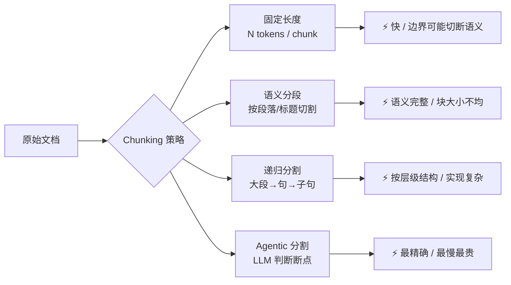
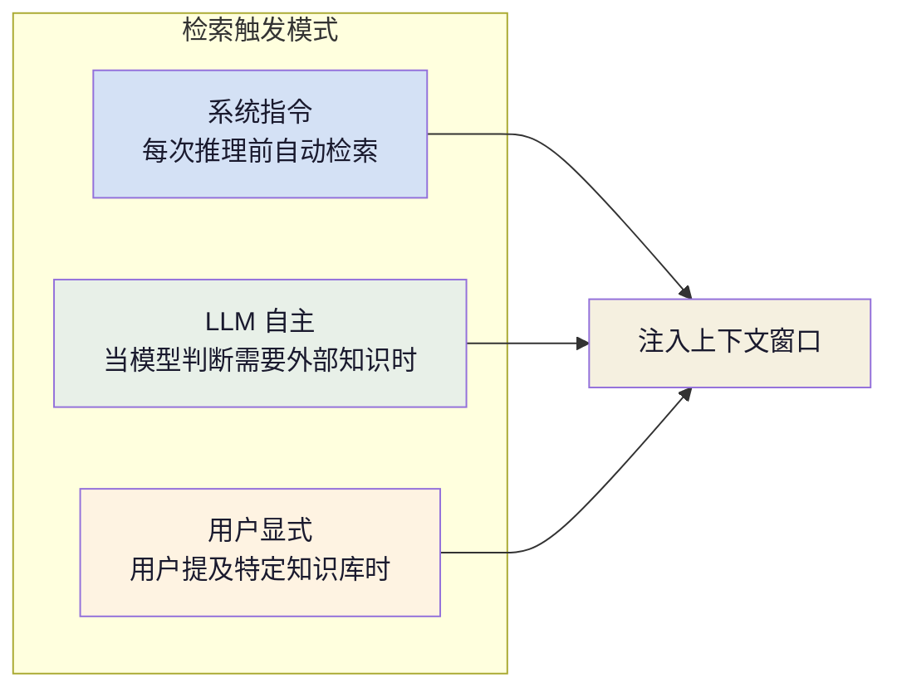

+++
title = "AI 智能体基础（五）：RAG 知识检索"
slug = "ai-agent-05-rag"
date = 2026-06-17
categories = ["LLM 基础"]
tags = ["AI 智能体"]
draft = true
showToc = true
TocOpen = true
description = "Agentic RAG 的完整解析——从传统 RAG 到 Agentic 检索的演进、四种检索策略的对比与选型、索引设计（Chunking 策略/元数据标注）、以及检索结果在 Agent 上下文中的注入与利用。"
+++

前一篇记忆系统解决了 Agent"记住交互历史"的问题，但 Agent 还需要一种能力——**获取它从未见过的事实知识**。训练语料中可能没有用户公司内部的 API 文档，最后一轮会话中也从未讨论过 Redis 配置的细节。

RAG（Retrieval-Augmented Generation）正是填补这个缺口的技术。它不是记忆系统的替代品，而是一个平行体系：记忆管"我做过什么"，RAG 管"世界已知什么"。两者构成了 Agent 知识体系的两个源头。

本文从 RAG 在 Agent 架构中的定位出发，覆盖四种检索策略的原理与选型、索引设计的关键决策，以及检索结果如何参与 Agent 推理循环。

---

## 1. 定义与定位

### 1.1 RAG 在智能体架构中的角色

RAG 的核心思想很简单：在 LLM 生成回答之前，先从外部知识库中检索相关文本片段，将其作为上下文注入输入。形式化表示为：

$$
\text{Answer} = \text{LLM}(\text{Query} \oplus \text{Retrieve}(\text{Query}, \mathcal{D}))
$$

其中 $\mathcal{D}$ 是知识库文档集合，$\oplus$ 表示拼接操作。检索模块 $\text{Retrieve}$ 负责找出与当前查询最相关的 $k$ 个片段。

在智能体架构中，RAG 输出的是 **静态知识**——文档中已记录的事实，不随时间变化。这与记忆系统形成互补：

| | 记忆系统 | RAG |
|:--|:---------|:-----|
| 数据类型 | 动态交互历史、操作结果 | 静态文档知识 |
| 写入者 | Agent 自身（自动） | 业务系统 / 开发者（人工） |
| 更新频率 | 每轮交互 | 按需发布 |
| 使用者 | 单个 Agent 实例 | 可被多 Agent 共享 |
| 一致性保证 | 弱（摘要可能有损） | 强（原文引用） |

### 1.2 传统 RAG vs Agentic RAG

RAG 的发展历程经历了三个阶段，当前 Agent 实践主要处于第二阶段并逐渐向第三阶段演进：

| 阶段 | 检索方式 | 控制流 | Token 效率 |
|:----|:---------|:-------|:-----------|
| **Naive RAG** | 单次向量检索 Top-K | 固定：检索 → 生成 | 低（检索结果可能无关） |
| **Advanced RAG** | 混合检索 + 重排序 + 查询改写 | 可配置管道 | 中 |
| **Agentic RAG** | 多步迭代检索，LLM 自主决策 | 动态：判断 → 检索 → 判断 → ... | 高（只取必要信息） |

**Naive RAG** 的问题在于检索质量完全依赖单次向量相似度搜索，查询表述不佳或知识库规模大时准确率急剧下降。**Agentic RAG** 的核心变化是将检索决策权交给 LLM——模型判断当前信息是否充足，不足则发起新一轮检索，且可动态切换检索策略：

```text
Agentic RAG 执行轨迹示例：

用户："SSL 502 错误怎么处理？"

Round 1：检索 → 得到 SSL 配置文档片段
→ 模型判断：缺少错误码 502 的具体信息

Round 2：检索(query="502 错误 网关超时") →
得到 Nginx 502 处理指南
→ 模型判断：信息充足

输出：结合 SSL 配置和 502 处理方案的完整回答
```

### 1.3 与记忆系统的协作模式

实践中，RAG 和记忆系统以**分段注入**的方式共存于 agent 的上下文中：

```python
def build_injection_context(
    query: str,
    rag_results: list[str],
    memory_results: list[str]
) -> list[dict]:
    """构建注入上下文：RAG 与记忆分段注入"""
    context_messages = []

    if rag_results:
        context_messages.append({
            "role": "system",
            "content": (
                "【参考文档】\n"
                + "\n\n".join(
                    f"[{i+1}] {text}"
                    for i, text in enumerate(rag_results)
                )
                + "\n\n请优先引用以上文档回答，"
                "无法覆盖的部分由模型知识补全。"
            )
        })

    if memory_results:
        context_messages.append({
            "role": "system",
            "content": (
                "【历史经验】\n"
                + "\n\n".join(memory_results)
                + "\n\n以上是过去交互中积累的经验，"
                "仅供参考，以参考文档为准。"
            )
        })

    return context_messages
```

分段注入的关键在于**标注来源的优先级**。文档知识优先于记忆，记忆优先于模型参数知识——这种层次告诉 LLM 在信息冲突时采信的顺序。

---

## 2. 检索策略

四种检索策略在精度、成本和覆盖面上各有侧重：


### 2.1 向量检索

向量检索是 RAG 的默认方案。文档被嵌入模型转换为稠密向量，查询时计算查询向量与文档向量的余弦相似度或内积，取 Top-K。

```python
import chromadb

class VectorRetriever:
    """基于向量检索的检索器"""

    def __init__(self, collection_name: str, embed_model: str = "text-embedding-3-small"):
        self.client = chromadb.PersistentClient()
        self.collection = self.client.get_or_create_collection(
            name=collection_name,
            metadata={"hnsw:space": "cosine"}
        )
        # 嵌入模型由 Chroma 内部管理

    def index_documents(self, docs: list[str], metadatas: list[dict] = None):
        """批量索引文档"""
        self.collection.add(
            documents=docs,
            metadatas=metadatas or [{}] * len(docs),
            ids=[f"doc_{hash(d)}" for d in docs]
        )

    def retrieve(self, query: str, top_k: int = 5) -> list[tuple[str, float]]:
        """检索 Top-K 相关文档"""
        results = self.collection.query(
            query_texts=[query],
            n_results=top_k
        )
        docs = results["documents"][0] if results["documents"] else []
        scores = results["distances"][0] if results["distances"] else []
        return list(zip(docs, scores))
```

向量检索的核心局限：对**精确关键词匹配**天生弱项。查询"API 版本 v3.2.1"时，向量检索可能返回"API 版本升级指南"而忽略"v3.2.1 release notes"——因为语义上"版本"接近但关键词"v3.2.1"被语义嵌入模糊化了。

### 2.2 混合检索

混合检索同时执行向量检索和全文检索（BM25），然后融合结果排序。融合算法最常用的是 **RRF（Reciprocal Rank Fusion）**：

$$
\text{RRF}(d) = \sum_{r \in \mathcal{R}} \frac{1}{k + r(d)}
$$

其中 $r(d)$ 是文档 $d$ 在检索结果 $r$ 中的排名，$k$ 是平滑常数（通常取 60）。

```python
class HybridRetriever:
    """混合检索：向量 + BM25 全文"""

    def __init__(self, collection_name: str):
        self.vector_db = chromadb.PersistentClient()
        self.collection = self.vector_db.get_or_create_collection(collection_name)
        self.bm25_index = None
        self.documents: list[str] = []

    def index_documents(self, docs: list[str], metadatas: list[dict] = None):
        self.documents = docs
        # 向量索引
        self.collection.add(
            documents=docs,
            metadatas=metadatas or [{}] * len(docs),
            ids=[f"doc_{i}" for i in range(len(docs))]
        )
        # BM25 索引
        tokenized = [doc.lower().split() for doc in docs]
        from rank_bm25 import BM25Okapi
        self.bm25_index = BM25Okapi(tokenized)

    def retrieve(self, query: str, top_k: int = 5) -> list[str]:
        # 向量检索
        vec_results = self.collection.query(
            query_texts=[query], n_results=top_k * 2
        )
        vec_ids = vec_results["ids"][0] if vec_results["ids"] else []

        # BM25 检索
        tokenized_query = query.lower().split()
        bm25_scores = self.bm25_index.get_scores(tokenized_query)
        bm25_ranked = sorted(
            range(len(self.documents)),
            key=lambda i: bm25_scores[i],
            reverse=True
        )[:top_k * 2]

        # RRF 融合
        rrf_scores = {}
        k = 60
        for rank, doc_id in enumerate(vec_ids):
            idx = int(doc_id.split("_")[1])
            rrf_scores[idx] = rrf_scores.get(idx, 0) + 1 / (k + rank + 1)
        for rank, idx in enumerate(bm25_ranked):
            rrf_scores[idx] = rrf_scores.get(idx, 0) + 1 / (k + rank + 1)

        ranked = sorted(rrf_scores.items(), key=lambda x: -x[1])
        return [self.documents[idx] for idx, _ in ranked[:top_k]]
```

**何时选择混合检索**：当知识库中包含大量专有名词（产品名、版本号、API 路径）时，纯向量检索可能遗漏精确匹配，混合检索是安全的选择。

### 2.3 Graph RAG

Graph RAG 将文档中提取的实体和关系构建为知识图谱，检索时不再依赖文本语义相似度，而是**沿着图谱中的关系路径遍历**。

适用于需要多跳推理的场景：

```text
查询："对比 Redis 和 Memcached 的适用场景"

向量检索可能返回：两篇分别介绍 Redis 和 Memcached 的文档

Graph RAG 查询路径：
Redis(实体) —[特性]→ 持久化支持 —[对比]→ 适用场景
                          ↕
Memcached(实体) —[特性]→ 纯内存 —[对比]→ 适用场景
```

Graph RAG 的知识图谱支持跨多跳关系找到间接关联的信息，但构建成本显著高于向量索引——需要实体抽取、关系分类、消歧等一系列 NLP 预处理步骤。

### 2.4 Agentic 检索

Agentic RAG 将检索从"一次命中"转化为**多步迭代的探索过程**。LLM 不再被动接收单次检索结果，而是主动管理检索过程：

```python
class AgenticRetriever:
    """多步迭代检索器——让 LLM 决定检索策略"""

    def __init__(self, retrievers: dict[str, Retriever]):
        self.retrievers = retrievers
        self.client = OpenAI()

    def retrieve(self, query: str, max_rounds: int = 3) -> list[str]:
        context = []
        accumulated = []

        for _round in range(max_rounds):
            # LLM 判断当前信息缺口，决定下一次检索
            action = self._decide_next(query, accumulated)

            if action["type"] == "answer":
                break  # 信息充足，终止检索

            # 执行指定的检索策略
            retriever = self.retrievers.get(action["retriever"])
            if not retriever:
                continue

            new_results = retriever.retrieve(action["query"])
            if new_results:
                accumulated.extend(new_results)
                context.append({
                    "round": _round,
                    "strategy": action["retriever"],
                    "query": action["query"],
                    "results": new_results
                })

        return accumulated

    def _decide_next(self, query: str,
                     accumulated: list[str]) -> dict:
        """LLM 判断下一轮检索策略"""
        prompt = (
            f"原始查询：{query}\n\n"
            f"当前已获得的信息：\n{chr(10).join(accumulated[-5:])}\n\n"
            "当前信息是否足够回答？\n"
            "- 足够 → 输出 {\"type\": \"answer\"}\n"
            "- 信息不足 → 输出 {\"type\": \"retrieve\", "
            "\"retriever\": \"向量|混合|全文|图\", "
            "\"query\": \"下一轮检索查询\"}"
        )
        resp = self.client.chat.completions.create(
            model="gpt-4o-mini",
            messages=[
                {"role": "system", "content": "你是一个检索策略决策者。"},
                {"role": "user", "content": prompt}
            ],
            response_format={"type": "json_object"},
            temperature=0.0
        )
        return json.loads(resp.choices[0].message.content or '{"type": "answer"}')
```

Agentic RAG 的代价是额外 LLM 调用带来的延迟和 token 消耗。适用条件是：**单次检索的失败成本高于多步检索的额外开销**——比如用户正在调试生产环境，一次错误的回答可能导致误操作，值得多检索一轮。

---

## 3. 索引设计

检索质量的上限在索引阶段就已确定。两个关键决策决定了这个上限：chunking 策略和元数据设计。

### 3.1 Chunking 策略

文档切割成块的方式直接决定了检索命中精度：



四种策略的对比：

| 策略 | 分块依据 | 块大小一致性 | 语义完整性 | 实现成本 |
|:----|:---------|:------------:|:---------:|:--------:|
| 固定长度 | token 计数器 | 高 | 低（可能切断句子） | 最低 |
| 语义分段 | 标题 / 换行符 | 中 | 高 | 低 |
| 递归分割 | 按分隔符优先级递归 | 中 | 中高 | 中 |
| Agentic 分割 | LLM 识别语义边界 | 低 | 最高 | 高 |

**实践建议**：默认使用**语义分段**，按 markdown 标题或空行分割。对于代码文档（函数边界明确）或法律合同（条款边界明确），首选 Agentic 分割；对于日志或非结构化文本，首选固定长度 + 有重叠（overlap=10-20%）。

```python
def semantic_chunking(text: str,
                       max_chunk_size: int = 1000,
                       overlap: int = 100) -> list[str]:
    """按段落语义分块"""
    import re

    # 先按空行分割为段
    paragraphs = re.split(r'\n\s*\n', text.strip())
    chunks = []
    current = []

    for para in paragraphs:
        current.append(para)
        current_text = "\n\n".join(current)

        # 如果当前块已超过阈值，输出并保留 overlap
        if len(current_text) > max_chunk_size:
            # 去掉最后一个段（回退）
            current.pop()
            if current:
                chunks.append("\n\n".join(current))
            # overlap：保留最后一个段作为下一块的开始
            current = [current[-1]] if current else [para]

    if current:
        chunks.append("\n\n".join(current))
    return chunks
```

### 3.2 检索质量的关键参数

| 参数 | 推荐值 | 说明 |
|:-----|:------|:------|
| Chunk 大小 | 256-1024 tokens | 太小缺乏上下文，太大稀释相关性 |
| Overlap | 10-20% | 避免边界切断导致信息丢失 |
| Top-K 初选 | 20-50 | 召回足够候选供重排序筛选 |
| Top-K 终选 | 3-5 | 注入上下文的片段数 |
| Embedding 模型 | text-embedding-3-small / bge-m3 | 维度 512-1024 平衡质量与速度 |

### 3.3 元数据标注与过滤

元数据是检索质量提升成本最低的手段。每条文档附带结构化元数据，检索时可以预过滤，大幅缩小搜索空间：

```python
def metadata_filtered_retrieve(
    query: str,
    filters: dict,
    collection
) -> list[str]:
    """带元数据过滤的检索"""
    results = collection.query(
        query_texts=[query],
        n_results=10,
        where=filters  # e.g. {"category": "api-docs", "version": "v3"}
    )
    return results["documents"][0] if results["documents"] else []
```

推荐的元数据字段：

| 字段 | 示例值 | 过滤场景 |
|:-----|:-------|:---------|
| `source` | "product_docs" / "bug_tracker" | 限定知识来源 |
| `category` | "api" / "config" / "tutorial" | 按类型筛选 |
| `version` | "v3.2" / "v4.0" | 版本过滤 |
| `date` | "2026-01-15" | 时效性过滤 |
| `tags` | ["redis", "cache", "performance"] | 多维度分类 |

---

## 4. 检索在 Agent 循环中的运作

### 4.1 检索触发

Agent 中检索的触发有三种模式：



**系统指令模式**用于每个任务都需要领域知识的场景（如客服 Agent 每次需要检索产品手册）。**LLM 自主模式**最灵活但增加了延迟（模型需要先判断是否需要检索、再发起检索）。**用户显式模式**最精确但依赖用户主动。

实践中推荐**系统指令 + LLM 自主的混合模式**——系统指令预注入当前任务的高概率相关知识（如产品名、版本号），运行中 LLM 按需补充检索。

### 4.2 结果注入与利用

检索结果注入上下文窗口的位置直接影响 LLM 的关注程度：

| 注入位置 | 影响 |
|:---------|:------|
| 系统消息（role: system） | 作为普遍指令，模型将其视为通用规则 |
| 用户消息前（插入第一条 user） | 作为任务背景，模型将其作为话题基础 |
| 用户消息后（追加在 user 后） | 作为参考材料，模型可能关注度降低 |

**推荐方案**：将检索结果注入系统消息，并用清晰的标记区分结果来源：

```text
【参考文档】
以下是从知识库中检索到的相关内容，请优先引用：

[1] SSL 证书配置指南（v3.2.1）
  将证书文件放置于 /etc/ssl/certs/，然后在 nginx.conf 中配置 ssl_certificate 和 ssl_certificate_key 指令。

[2] HTTP 502 错误排查
  502 Bad Gateway 通常表示上游服务不可用。检查：
  - 后端服务是否正常运行
  - 代理配置中的 upstream 地址是否正确
  - 防火墙是否阻止了代理与后端的通信

请引用上述文档回答用户问题。超出文档范围的内容由模型知识补充，但需标注"以下为模型推测"。
```

### 4.3 检索失败的四种处理

检索可能失败。Agent 应该预设每种失败情况的应对策略：

| 失败模式 | 表现 | 应对策略 |
|:---------|:-----|:---------|
| **空结果** | 检索返回 0 条 | 放宽过滤条件 / 换检索策略 / 告知用户未找到 |
| **低分结果** | 检索结果相关性都低于阈值 | 降低阈值重试 / 提示模型"结果可能不相关" |
| **过时信息** | 检索到旧版本文档 | 版本元数据预过滤 / 模型交叉验证 |
| **检索幻觉** | 检索结果与事实矛盾 | 多源交叉验证 / 注入"以模型知识为准"指令 |

```python
def safe_retrieve(retriever, query: str,
                  confidence_threshold: float = 0.3) -> list[str]:
    """带兜底策略的检索"""
    results = retriever.retrieve(query)

    if not results:
        # 策略 1：放宽过滤
        results = retriever.retrieve(query, strict=False)

    if not results:
        # 策略 2：尝试换检索策略
        results = retriever.retrieve(query, mode="bm25")

    if not results:
        # 兜底：告知 Agent 没有相关知识
        return ["(知识库中未找到相关内容，请依据模型自身知识回答)"]

    # 检查置信度
    if all(score < confidence_threshold for _, score in results):
        return [
            f"(以下内容相关性较低，仅供参考)\n{results[0][0]}"
        ]

    return [doc for doc, _ in results]
```

---

## 5. 质量优化

### 5.1 查询改写

查询改写是利用 LLM 将用户的原始自然语言问题转换为更适于检索的形式：

| 原始查询 | 改写后 |
|:---------|:--------|
| "登录页报了 500" | "登录页面 HTTP 500 错误 服务端异常 内部服务器错误" |
| "用户说收不到邮件" | "邮件发送失败 邮件无法接收 SMTP 错误" |

改写的目标是**补全隐式上下文、移除对话式语气、补充同义词**。对模型要求低，gpt-4o-mini 级别即可：

```python
def rewrite_query(original: str, context: str = "") -> str:
    """将自然语言改写为检索友好的查询"""
    resp = client.chat.completions.create(
        model="gpt-4o-mini",
        messages=[
            {"role": "system", "content": (
                "将用户的问题改写为适合搜索引擎的查询词。"
                "输出关键词组合，不要多余文字。"
            )},
            {"role": "user", "content": f"上下文：{context}\n问题：{original}"}
        ],
        temperature=0.0
    )
    return resp.choices[0].message.content or original
```

### 5.2 重排序

向量检索初选的 Top-K（如 20 条）中只有前 3-5 条是真正相关的。重排器（Reranker）——通常是交叉编码器——对已召回的结果逐对评分，大幅提升排序质量：

```python
def rerank(query: str, candidates: list[str], top_k: int = 5) -> list[str]:
    """使用交叉编码器重排序"""
    from sentence_transformers import CrossEncoder

    reranker = CrossEncoder("cross-encoder/ms-marco-MiniLM-L-6-v2")
    pairs = [(query, doc) for doc in candidates]
    scores = reranker.predict(pairs)

    ranked = sorted(
        zip(candidates, scores),
        key=lambda x: x[1], reverse=True
    )
    return [doc for doc, _ in ranked[:top_k]]
```

**关键：重排器的输入是已召回的 Top-N，而非全文库**。向量检索做初筛（从百万级降到百级），重排器做精排（从百级降到个级）。两个阶段的成本差距巨大——向量检索扫描全部索引但计算简单，重排器逐对计算但只处理少量候选。

### 5.3 检索评估

RAG 质量评估有四个标准维度，已被集成到 LangSmith、Langfuse 等可观测平台中：

| 指标 | 定义 | 测量方式 |
|:-----|:-----|:---------|
| **Context Precision** | 检索结果中有多少比例是相关的 | 人工标注 / LLM 评判 |
| **Context Recall** | 回答所需的相关信息被检索出了多少 | LLM 对比回答与检索结果 |
| **Faithfulness** | 模型的回答是否忠实于检索结果 | LLM 对比回答与检索结果 |
| **Answer Relevance** | 最终回答是否回答了用户的查询 | LLM 评判 |

这四个指标互为约束：提高 Recall 需要检索更多结果，但可能降低 Precision；提高 Faithfulness 需要模型严格遵循检索结果，但可能牺牲 Answer Relevance（如果检索结果本身不够直接）。Agent 实践中，**Precision 往往比 Recall 更重要**——注入一条无关信息可能带偏整个推理，而遗漏一条相关信息模型尚有自身知识可以补全。

---

## 核心概念速查

| 概念 | 定义 | 关键约束 |
|:----:|:------|:---------|
| RAG | 检索增强生成——外部知识注入 LLM 上下文 | 检索质量上界在索引阶段确定 |
| Agentic RAG | LLM 自主决策的多步迭代检索 | 额外 LLM 调用延迟 vs 检索失败成本 |
| 向量检索 | 语义嵌入 + 近似最近邻搜索 | 精确关键词匹配弱 |
| 混合检索 | 向量 + BM25 + RRF 融合 | 两套索引，延迟翻倍 |
| Graph RAG | 知识图谱实体关系遍历 | 构建成本高，适合多跳推理 |
| Chunking | 文档切割策略 | 块大小 256-1024 tokens，overlap 10-20% |
| 重排序 | 交叉编码器对已召回结果逐对评分 | 只处理 Top-N，不扫描全文库 |
| 查询改写 | LLM 将自然语言转换为检索友好形式 | 低模型要求，gpt-4o-mini 即可 |
| 元数据过滤 | 基于结构化字段预过滤检索空间 | 质量提升成本最低的手段 |
