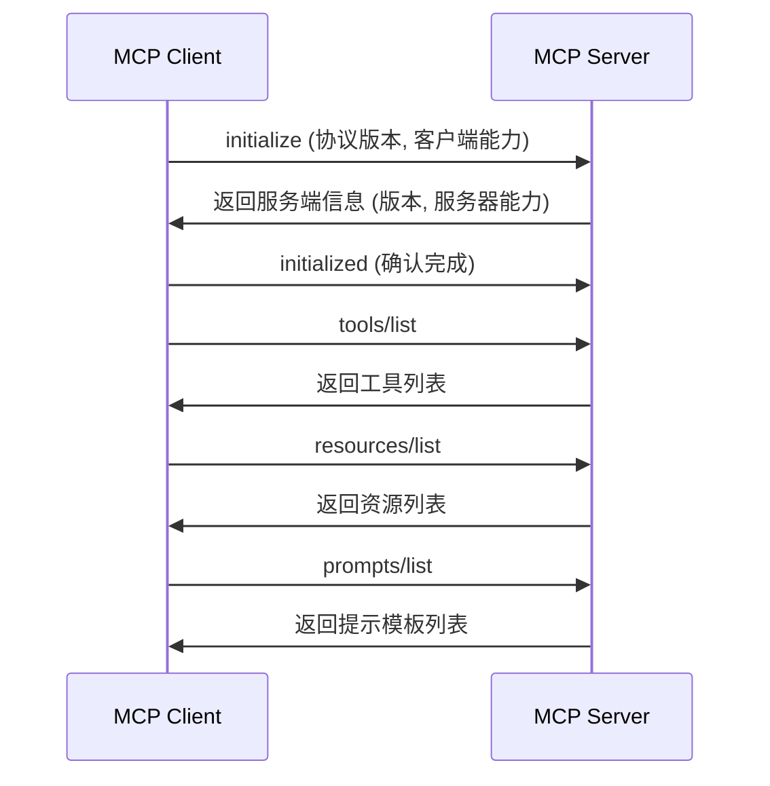

+++
title = "AI 智能体基础（六）：MCP 工具协议"
slug = "ai-agent-06-mcp"
date = 2026-06-17
categories = ["LLM 基础"]
tags = ["AI 智能体"]
draft = true
showToc = true
TocOpen = true
description = "Model Context Protocol 的完整解析——协议架构与设计动机、Host-Client-Server 三层模型、三大原语（Tools/Resources/Prompts）、传输层与初始化流程、与原生 Tool Calling 的对比、以及 2026 年生态现状。"
+++

在第二篇工具调用中，我们详细讨论了 LLM 如何通过 Tool Calling 协议调用外部函数。那个方案的问题是：每个 Agent 应用都要**自己实现一套工具注册、调度、执行的框架**，工具与宿主代码紧耦合，换一个应用就得重新实现一遍。

MCP（Model Context Protocol）正是为解决这个重复造轮子问题而生的开放协议——它定义了 LLM 应用与外部工具之间的**标准化接口**，让任何一个 MCP 兼容的 Agent 都能自动发现并使用任何一个 MCP 兼容的工具 Server。

Anthropic 在 2024 年 11 月发布了 MCP 规范。到 2026 年，MCP 已贡献给 Linux Foundation 下的 Agentic AI Foundation，成为行业基础设施——1,500+ 公开 MCP Server，Claude / OpenAI / LangChain / CrewAI / Google ADK 等主流平台都原生支持。

---

## 1. 定义与定位

### 1.1 MCP 解决了什么问题

在 MCP 出现之前，Agent 集成外部工具的典型做法是：

```python
# 每个 Agent 项目都要手动注册工具
registry = ToolRegistry()
registry.register("search_web", ..., web_search)
registry.register("read_file", ..., file_reader)
registry.register("query_db", ..., db_query)
# ... 新增工具就要改这里
```

这套模式的问题是：

| 问题 | 表现 |
|:-----|:------|
| **耦合紧** | 工具定义和 Agent 运行时在同一个进程、同一份代码中 |
| **难复用** | 在 Claude Desktop 中写好的 "filesystem" 工具，不能直接给自定义 Agent 用 |
| **无标准** | 每个 Agent 框架有自己的工具注册格式和传输方式 |
| **无发现** | Agent 无法在运行时才知道有哪些工具可用——必须在编码时就确定 |
| **无边界** | 工具的执行环境、权限控制、资源隔离全凭宿主自行实现 |

MCP 用一个简单的思路解决了这些问题：**把工具从「函数定义」抽象为「网络服务」**。工具不再是被 Agent 引用的一段代码，而是独立运行的服务，通过标准协议与 Agent 通信。

### 1.2 在 Agent 体系中的角色

回顾第一篇的四要素公式：

<div style="padding-left:1.5em">Agent = LLM（推理引擎）+ Tool Calling（工具调用）+ Memory（记忆系统）+ Loop（循环控制）</div>

MCP 实现的是 **Tool Calling** 层的标准化方案——它不改变第二篇讨论的 Tool Calling 协议（LLM 仍然输出 tool_calls），而是改变了 tool_calls 的目标路由方式。在原生 Tool Calling 中，tool_call 的目标是宿主进程中的一段代码；在 MCP 中，tool_call 的目标是 MCP Server 的一个端点。

更确切地说，MCP 是 Tool Calling 的 **"传输层 + 发现层 + 执行层"** 的标准化封装：

```
原生 Tool Calling:   LLM → Tool Schema → 宿主解析 → 执行函数 → 返回结果
MCP Tool Calling:    LLM → Tool Schema → MCP Client → MCP Server → 执行 → 返回
                                            ↓
                                    从 tools/list 发现工具
```

---

## 2. 协议架构

MCP 采用 **Host → Client → Server** 三层架构，基于 JSON-RPC 2.0：


### 2.1 三层职责

| 层 | 角色 | 职责 | 示例 |
|:---|:-----|:------|:------|
| **Host** | AI 应用 | 运行 LLM、提供用户界面、协调 Agent 循环 | Claude Desktop、IDE 插件、自定义 Agent |
| **Client** | 协议处理器 | 管理与 Server 的连接、缓存工具列表、路由请求 | MCP Client 库、LangChain MCP 适配器 |
| **Server** | 工具提供者 | 注册工具、资源、提示模板、执行具体操作 | filesystem-server、sqlite-server |

**关键设计**：Client 与 Server 是一对一关系，Host 与 Client 是一对多关系。一个 Host（如 Claude Desktop）可以同时连接多个 Server——每个 Server 提供一组工具，Host 将所有工具合并后提供给 LLM。

### 2.2 JSON-RPC 2.0 基础

MCP 的所有通信都基于 JSON-RPC 2.0 协议。一次典型的工具调用请求-响应如下：

```json
// 请求（Client → Server）
{
    "jsonrpc": "2.0",
    "id": 1,
    "method": "tools/call",
    "params": {
        "name": "read_file",
        "arguments": {
            "path": "/etc/config.json"
        }
    }
}

// 响应（Server → Client）
{
    "jsonrpc": "2.0",
    "id": 1,
    "result": {
        "content": [
            {
                "type": "text",
                "text": "{\"host\": \"localhost\", \"port\": 8080}"
            }
        ],
        "isError": false
    }
}
```

MCP 定义了三类方法：**初始化**（initialize/initialized）、**发现**（tools/list、resources/list、prompts/list）、**操作**（tools/call、resources/read、prompts/get）。

---

## 3. 三大原语

MCP 定义了三个核心原语——Tools、Resources、Prompts。理解这三者的区别是使用 MCP 的基础：

| 原语 | 类型 | 操作 | 有无副作用 | 类比 |
|:----|:----|:-----|:---------|:-----|
| **Tools** | 可执行 | tools/call | 可有 | REST API 的 POST |
| **Resources** | 只读数据 | resources/read | 无 | REST API 的 GET |
| **Prompts** | 模板 | prompts/get | 无 | 可复用的 prompt 片段 |

### 3.1 Tools

Tools 对应第二篇中讨论的工具——LLM 可调用的函数。MCP Server 在初始化时通过 `tools/list` 返回工具列表：

```json
// tools/list 响应
{
    "jsonrpc": "2.0",
    "id": 1,
    "result": {
        "tools": [
            {
                "name": "read_file",
                "description": "读取指定文件的内容，适用于文本文件",
                "inputSchema": {
                    "type": "object",
                    "properties": {
                        "path": {"type": "string", "description": "文件路径"}
                    },
                    "required": ["path"]
                }
            },
            {
                "name": "write_file",
                "description": "写入内容到指定文件",
                "inputSchema": {
                    "type": "object",
                    "properties": {
                        "path": {"type": "string", "description": "文件路径"},
                        "content": {"type": "string", "description": "写入内容"}
                    },
                    "required": ["path", "content"]
                }
            }
        ]
    }
}
```

注意工具的 Schema 格式与 OpenAI Function Calling 格式略有不同：MCP 使用 `inputSchema`（而非 `parameters`），且参数的 `required` 数组位于 schema 顶层而非与 `properties` 同级。

### 3.2 Resources

Resources 是**只读数据**，通过 URI 标识。与 Tools 不同，Resources 的读取不产生副作用，也不会被 LLM 直接调用——它更像是 Server 暴露给 Host 的"可访问数据列表"。

```json
// resources/list 响应
{
    "result": {
        "resources": [
            {
                "uri": "file:///logs/app.log",
                "name": "Application Log",
                "description": "应用程序最新 1000 行日志",
                "mimeType": "text/plain"
            },
            {
                "uri": "file:///config/app.json",
                "name": "App Config",
                "description": "应用程序配置文件",
                "mimeType": "application/json"
            }
        ]
    }
}
```

Host（而非 LLM）决定何时读取 Resource。典型场景：Agent 在推理前，Host 自动读取相关 Resource 作为上下文注入。

### 3.3 Prompts

Prompts 是 Server 暴露的**可复用模板**——一组结构化的消息模板，Host 可以将其插入到对话中。每个 Prompt 可以包含动态参数：

```json
// prompts/list 响应
{
    "result": {
        "prompts": [
            {
                "name": "analyze_error",
                "description": "分析错误日志并提供修复建议",
                "arguments": [
                    {
                        "name": "error_message",
                        "description": "错误信息原文",
                        "required": true
                    }
                ]
            }
        ]
    }
}
```

```json
// prompts/get 请求
{
    "method": "prompts/get",
    "params": {
        "name": "analyze_error",
        "arguments": {
            "error_message": "Connection refused: /api/db:5432"
        }
    }
}
```

Prompts 的定位介于 Tools 和 Resources 之间：它像 Tool 一样接收参数并返回内容，但不产生副作用；它像 Resource 一样提供信息，但内容可根据参数动态生成。

---

## 4. 传输层

MCP 支持两种传输方式：

| 传输方式 | 连接方式 | 适用场景 |
|:---------|:---------|:---------|
| **stdio** | Host 作为子进程启动 Server，通过 stdin/stdout 通信 | 本地工具、安全敏感操作 |
| **Streamable HTTP** | HTTP POST + 可选 SSE，远程连接 | 网络服务、多租户部署 |

### 4.1 stdio 传输

stdio 是最安全的传输方式——MCP Server 作为子进程运行在 Host 所在的机器上，不需要网络暴露：

```python
import subprocess
import json

class StdioMCPClient:
    """通过 stdio 启动并连接 MCP Server"""

    def __init__(self, server_command: list[str]):
        self.process = subprocess.Popen(
            server_command,
            stdin=subprocess.PIPE,
            stdout=subprocess.PIPE,
            stderr=subprocess.PIPE,
            text=True
        )
        self._request_id = 0

    def _send_request(self, method: str, params: dict = None) -> dict:
        self._request_id += 1
        request = {
            "jsonrpc": "2.0",
            "id": self._request_id,
            "method": method,
            "params": params or {}
        }
        self.process.stdin.write(json.dumps(request) + "\n")
        self.process.stdin.flush()
        response = self.process.stdout.readline()
        return json.loads(response)

    def initialize(self) -> dict:
        """初始化握手"""
        return self._send_request("initialize", {
            "protocolVersion": "2025-03-26",
            "capabilities": {"tools": {}}
        })

    def list_tools(self) -> list[dict]:
        """获取工具列表"""
        result = self._send_request("tools/list")
        return result.get("result", {}).get("tools", [])

    def call_tool(self, name: str, arguments: dict) -> dict:
        """调用工具"""
        return self._send_request("tools/call", {
            "name": name,
            "arguments": arguments
        })

    def close(self):
        self.process.terminate()
```

使用方式：

```python
# 启动一个 filesystem MCP Server
client = StdioMCPClient(["npx", "@anthropic/mcp-filesystem", "/allowed/path"])
client.initialize()

# 动态发现工具
tools = client.list_tools()
for tool in tools:
    print(f"  {tool['name']}: {tool['description']}")

# 调用工具
result = client.call_tool("read_file", {"path": "/allowed/path/config.json"})
```

### 4.2 Streamable HTTP 传输

远程场景下，MCP 通过 HTTP POST 通信。Server 暴露一个 HTTP 端点，Client 向其发送 JSON-RPC 请求：

```python
import httpx

class HTTPMCPClient:
    """通过 HTTP 连接远程 MCP Server"""

    def __init__(self, endpoint: str):
        self.endpoint = endpoint
        self.client = httpx.Client()
        self._request_id = 0

    def _post(self, body: dict) -> dict:
        self._request_id += 1
        body["id"] = self._request_id
        response = self.client.post(
            self.endpoint,
            json=body,
            headers={"Content-Type": "application/json"}
        )
        return response.json()
```

Streamable HTTP 传输将 MCP 从本地工具协议扩展为通用的网络协议，使得企业可以部署中心化的 MCP Server 网关供多个 Agent 使用。

---

## 5. 协议全生命周期

### 5.1 初始化握手

每个 MCP Server 连接的第一件事是初始化握手——Client 和 Server 协商协议版本和能力集：



初始化完成之后，Client 缓存 Server 的能力列表。在后续交互中，这些列表被注入 LLM 的上下文作为 Tool Schema，Client 负责将 LLM 的 tool_call 路由到对应的 Server。

### 5.2 工具调用流

一个完整的 MCP 工具调用链路：

```text
步骤 1: Agent 运行时将缓存的所有工具 Schema 拼入 system prompt
步骤 2: LLM 生成 tool_call，包含工具名和参数
步骤 3: MCP Client 根据工具名查找对应的 Server
步骤 4: Client 向目标 Server 发送 tools/call（JSON-RPC）
步骤 5: Server 执行操作，返回结果
步骤 6: Client 将结果以 tool 消息回传上下文
步骤 7: LLM 继续下一轮推理
```

### 5.3 错误处理

MCP 的错误处理遵循与第二篇相同的原则——**错误以结构化文本返回，由 LLM 决策下一步**。Server 在结果中设置 `isError` 标记：

```json
// 工具执行失败
{
    "jsonrpc": "2.0",
    "id": 1,
    "result": {
        "content": [
            {
                "type": "text",
                "text": "File not found: /etc/config.json"
            }
        ],
        "isError": true   ← 标记为错误
    }
}
```

`isError=true` 表示结果包含错误信息而非正常结果。它与 HTTP 状态码的关系：传输层面的错误（连接失败、超时、协议错误）使用 JSON-RPC 的 error 对象；业务逻辑层面的错误（文件不存在、参数无效）使用 result 中的 `isError` 标记：

| 错误层次 | 表示方式 | 示例 |
|:---------|:---------|:------|
| 传输错误 | JSON-RPC error | 连接超时、Server 崩溃 |
| 协议错误 | JSON-RPC error | 方法不存在、参数类型错误 |
| 业务错误 | result.isError = true | 文件不存在、权限不足 |

---

## 6. MCP vs 原生 Tool Calling

两种方案各有适用场景，不是替代关系，是不同抽象层次的选择：


### 6.1 选型决策

| 条件 | 推荐方案 |
|:-----|:---------|
| 工具固定、不常变动、代码库内 | 原生 Tool Calling |
| 工具由第三方提供、需要动态接入 | MCP |
| 单进程应用，工具调用简单 | 原生 Tool Calling |
| 多 Agent 共享同一组工具 | MCP |
| 工具在远程服务器上 | MCP（Streamable HTTP） |
| 对延迟敏感，希望省去进程间通信 | 原生 Tool Calling |

### 6.2 实际部署：混合模式

2026 年的生产实践中，大多数 Agent 同时使用两种方式：

```python
class HybridToolDispatcher:
    """混用原生 Tool Calling 和 MCP"""

    def __init__(self):
        self.native_tools = {}      # name → handler
        self.mcp_clients = {}       # server_name → MCPClient

    def register_native(self, name: str, handler: callable):
        self.native_tools[name] = handler

    def register_mcp_server(self, name: str, client):
        self.mcp_clients[name] = client

    def get_all_schemas(self) -> list[dict]:
        """聚合所有工具的 Schema"""
        schemas = []

        # 原生工具
        for name, handler in self.native_tools.items():
            schemas.append(get_schema(handler))  # 从 handler 推断

        # MCP 工具
        for server_name, client in self.mcp_clients.items():
            for tool in client.list_tools():
                schemas.append({
                    "name": f"{server_name}_{tool['name']}",
                    "description": tool["description"],
                    "parameters": tool["inputSchema"]
                })

        return schemas

    def dispatch(self, name: str, arguments: dict) -> str:
        # 检查是否为 MCP 工具
        for server_name, client in self.mcp_clients.items():
            if name.startswith(f"{server_name}_"):
                tool_name = name[len(server_name) + 1:]
                result = client.call_tool(tool_name, arguments)
                return result["result"]["content"][0]["text"]

        # 否则按原生工具处理
        handler = self.native_tools.get(name)
        if handler:
            return str(handler(**arguments))

        return f"Error: unknown tool '{name}'"
```

这种混合模式的关键决策是**命名空间**（如 `server_name/tool_name`），避免不同 Server 之间的工具名冲突。

---

## 7. 2026 年生态

### 7.1 标准地位

MCP 已成为 AI Agent 工具协议的事实标准：

- **治理**：Linux Foundation 下的 Agentic AI Foundation
- **公开 Server**：1,500+，涵盖文件系统、数据库、API 集成、IDE、设计工具
- **原生支持**：Claude Desktop / OpenAI Agents SDK / LangChain & LangGraph / CrewAI / Google ADK / Mastra
- **企业部署**：76% 的软件供应商在探索或已实现 MCP（CData 2026 报告）

### 7.2 MCP vs A2A

MCP 和 A2A（Agent-to-Agent Protocol，将在第八篇讨论）的关系在 2026 年已经明确——它们是**互补的**，不是竞争的：

| 维度 | MCP | A2A |
|:-----|:-----|:-----|
| 解决什么问题 | Agent ↔ 工具 | Agent ↔ Agent |
| 方向 | 垂直（下连工具） | 水平（互连 Agent） |
| 拓扑 | Client-Server | Peer-to-Peer |
| 发现方式 | 同一进程内 tools/list | 通过网络 AgentCard 发现 |
| 状态模型 | 无状态 | Task 状态机 |

实践中两者组成三層结构：**A2A（Agent之间）→ MCP（Agent连接工具）**。

### 7.3 2026 年重要发展

| 发展 | 含义 |
|:-----|:------|
| **MCP-AX 草案** | IETF 草案，层级命名空间聚合，支持受限设备（UART/BLE） |
| **MCP Workflow Engine** | Agent 一次推理产出声明式 workflow 蓝图，后续执行减少 99% token 消耗 |
| **MCP over MOQT** | 基于 QUIC 的发布-订阅传输，支持 Agent Skills 渐进加载 |
| **OAuth 2.1 集成** | 标准化的 MCP Server 鉴权 |

---

## 核心概念速查

| 概念 | 定义 | 关键约束 |
|:----:|:------|:---------|
| MCP | Model Context Protocol，Agent ↔ 工具的标准化通信协议 | 基于 JSON-RPC 2.0，Linux Foundation 治理 |
| Host | AI 应用层，运行 LLM 和 Agent 循环 | 同时管理多个 Client |
| Client | 协议处理器，管理与 Server 的连接 | 每个 Client 对应一个 Server 连接 |
| Server | 工具提供者，暴露 Tools/Resources/Prompts | 通过 stdio 或 HTTP 暴露接口 |
| Tools | MCP 的可执行原语，有副作用 | tools/list 发现，tools/call 执行 |
| Resources | MCP 的只读数据原语，无副作用 | 通过 URI 标识，Host 决定读取时机 |
| Prompts | MCP 的可复用模板原语 | 接收参数返回消息模板 |
| stdio 传输 | 子进程 stdin/stdout 通信 | 最安全，适合本地工具 |
| Streamable HTTP | HTTP POST + SSE 远程通信 | 适合网络部署 |
| 初始化握手 | Client-Server 协商版本与能力 | protocolVersion + capabilities |
