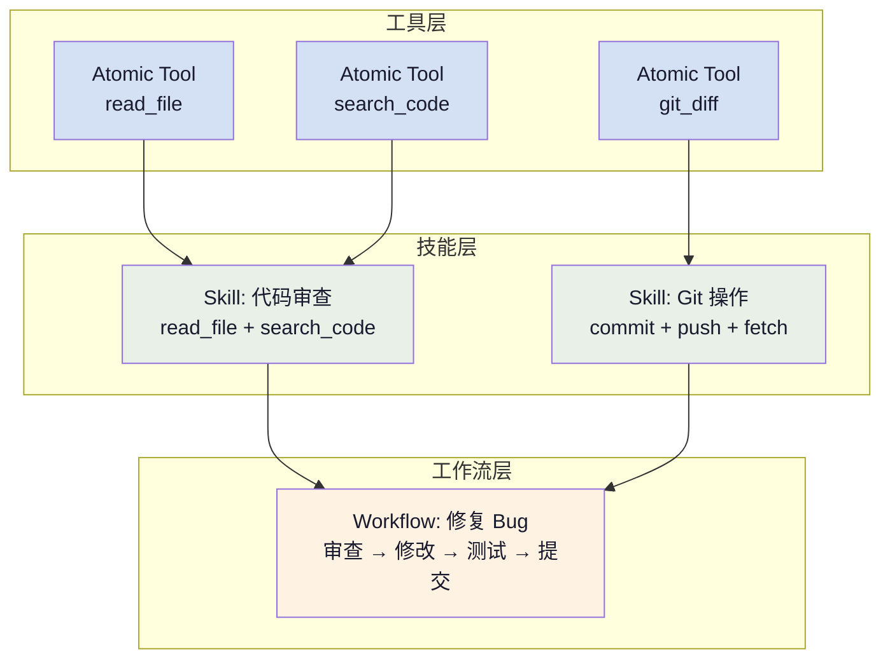

+++
title = "AI 智能体基础（七）：Skill 技能系统"
slug = "ai-agent-07-skill"
date = 2026-06-17
categories = ["LLM 基础"]
tags = ["AI 智能体"]
draft = true
showToc = true
TocOpen = true
description = "技能系统的完整解析——从原子 Tool 到复 合 Skill 再到 Workflow 的抽象层次、MCP 中原语如何作为技能模板、技能的动态发现与编排、以及主流框架中技能系统的实现对比。"
+++

前面的五篇逐步搭建了 Agent 的完整组件体系：核心循环让它运转，工具调用让它行动，推理模式让它决策，记忆系统让它记住，RAG 让它知道。但还有一个问题没有解决——**工具是零散的，任务是复合的**。

"调试生产环境"不是一个单一的 `read_file` 或 `execute_command` 能完成的，它需要一系列工具的协同：先查日志、再看配置、然后检查服务状态，最后综合分析。如果每次遇到类似任务都要 LLM 从头规划，不仅效率低，而且每一步都有偏离方向的风险。

技能系统（Skill System）正是为解决这个问题而生的抽象层——它将一组相关工具和它们的调用模式包装为**可复用的能力模块**，让 Agent 可以像"搭积木"一样组合这些模块来完成复杂任务。

---

## 1. 定义与定位

### 1.1 什么是技能

技能是 Agent 可复用的能力模块，定义了一组相关操作及其编排方式。它与工具（Tool）的区别在于：

| 维度 | Tool | Skill |
|:-----|:-----|:------|
| **粒度** | 原子操作 | 多个 Tool 的组合 |
| **状态** | 无状态（单次调用） | 可以有状态（多步推进） |
| **复用单位** | 被 Skill 编排 | 被 Workflow 编排 |
| **领域** | 单域（读文件） | 域内聚合（代码审查） |
| **抽象层次** | 如何做（How） | 做什么（What） |
| **LLM 调用** | 不涉及 | 可以包含内置的 LLM 调用 |

对比代码中函数与模块的关系——Tool 是函数，Skill 是模块。函数（Tool）做一件事，模块（Skill）提供一组相关功能，使用者不需要知道内部调用了哪些函数。

### 1.2 在 Agent 体系中的角色

回顾全部组件的关系：



技能系统处于工具之上、工作流之下的中间层。它解决的核心问题是：**LLM 不应该在每次需要"审查代码"时都重新思考需要调用哪些工具**。

---

## 2. 三层抽象

从 Tool 到 Skill 到 Workflow，三层抽象构成了完整的能力金字塔：


### 2.1 Tool：原子操作单元

Tool 是能力的最小单位。它的特征是：
- **单一职责**：只做一件事（读文件、执行命令、查数据库）
- **无状态**：每次调用独立，不依赖上下文
- **由 LLM 直接调用**：LLM 在推理中通过 tool_calls 决定何时调用哪个 Tool

对应第二篇和第六篇讨论的原生 Tool Calling 和 MCP Tools。

### 2.2 Skill：可复用能力模块

Skill 是对一组 Tool 的封装，提供更高层级的抽象。它的特征是：

| 特征 | 说明 |
|:-----|:------|
| **多 Tool 编排** | 一次 Skill 调用可能涉及多个 Tool 的协作 |
| **域内聚合** | 属于同一领域或能力范畴（代码、Git、容器） |
| **可复用** | 多个 Workflow 可共享同一个 Skill |
| **可包含 LLM 推理** | 某些 Skill 内部可能内置 LLM 调用点 |

一个典型的 Skill 定义：

```python
class CodeReviewSkill:
    """代码审查技能：审查指定文件的代码质量"""

    def __init__(self, tool_dispatcher):
        self.dispatcher = tool_dispatcher

    @property
    def tools(self) -> list[str]:
        """该 Skill 依赖的 Tool 列表"""
        return ["read_file", "search_code", "git_diff"]

    @property
    def description(self) -> str:
        """Skill 的描述（供 LLM 理解用途）"""
        return (
            "审查指定文件的代码质量，包括代码风格、潜在 bug、"
            "安全问题和性能建议。需要读取文件内容和相关代码。"
        )

    def execute(self, file_path: str) -> str:
        """执行代码审查"""
        # Step 1: 读取文件
        content = self.dispatcher("read_file", {"path": file_path})
        if content.startswith("Error"):
            return content

        # Step 2: 搜索相关引用
        references = self.dispatcher(
            "search_code", {"query": f"import.*from.*{file_path}"}
        )

        # Step 3: 查 git 历史
        history = self.dispatcher(
            "git_diff", {"path": file_path, "commits": 5}
        )

        # 组合结果返回（不在这里做 LLM 分析，让 Agent 自己分析）
        return (
            f"=== {file_path} ===\n"
            f"--- 文件内容 ---\n{content[:3000]}\n\n"
            f"--- 相关引用 ---\n{references[:1000]}\n\n"
            f"--- 最近变更 ---\n{history[:1000]}"
        )
```

### 2.3 Workflow：完整任务工作流

Workflow 是最高层的抽象——它是一个完整的任务执行计划，由多个 Skill 和 Tool 按特定顺序编排而成。Workflow 通常由 LLM 在推理过程中动态生成（对应第三篇 Plan-and-Execute 模式），也可以是预定义的模板。

Workflow 与 Skill 的核心区别在于：**Skill 是"能做什么"的能力描述，Workflow 是"怎么做"的执行计划。**

---

## 3. MCP 中的技能实现

MCP 提供了三种实现技能系统的原语，覆盖不同抽象层次：

| MCP 原语 | 在技能系统中的角色 | 抽象层次 |
|:---------|:------------------|:---------|
| **Tools** | 原子能力单元 | Tool 层 |
| **Prompts** | 技能模板——定义如何使用 Tools 完成任务 | Skill 层 |
| **Resources** | 技能上下文数据 | Tool 层（数据） |

### 3.1 Prompts 作为技能模板

MCP 的 Prompts 是最接近"技能"概念的原语。一个 Prompt 定义一个可复用的任务模板，包含：
- 输入参数（Agent 调用时传入）
- 结构化的消息序列（指导 LLM 如何执行）
- 隐式或显式关联的工具

```python
class MCPSkillServer:
    """通过 MCP Prompts 实现技能系统"""

    def __init__(self):
        self.skills: dict[str, callable] = {}

    def register_skill(self, name: str, prompt_template: str,
                       tools: list[str], description: str):
        """注册技能"""
        self.skills[name] = {
            "prompt": prompt_template,
            "tools": tools,
            "description": description
        }

    def get_prompts(self) -> list[dict]:
        """返回 MCP prompts/list 响应"""
        return [
            {
                "name": name,
                "description": skill["description"],
                "arguments": [
                    {"name": "task", "description": "任务描述", "required": True}
                ]
            }
            for name, skill in self.skills.items()
        ]

    def get_prompt(self, name: str, arguments: dict) -> dict:
        """返回 MCP prompts/get 响应"""
        skill = self.skills.get(name)
        if not skill:
            return {"error": f"Skill '{name}' not found"}

        # 将 prompt 模板中的参数替换为实际值
        filled = skill["prompt"].replace(
            "{{task}}", arguments.get("task", "")
        )
        tools_hint = ", ".join(skill["tools"])

        return {
            "messages": [
                {
                    "role": "system",
                    "content": (
                        f"{filled}\n\n"
                        f"可用工具：{tools_hint}"
                    )
                },
                {
                    "role": "user",
                    "content": arguments.get("task", "")
                }
            ]
        }


# 注册一个"代码审查"技能
server = MCPSkillServer()
server.register_skill(
    name="code_review",
    prompt_template=(
        "你是一个代码审查专家。请按以下步骤审查代码：\n"
        "1. 读取文件内容\n"
        "2. 搜索相关引用和依赖\n"
        "3. 检查代码风格、潜在 bug、安全问题和性能建议\n"
        "4. 输出结构化的审查报告"
    ),
    tools=["read_file", "search_code", "git_diff"],
    description="审查代码质量，输出结构化的审查报告"
)
```

Agent 在推理时，通过 MCP 的 `prompts/get` 获取技能模板（即一份包含指导的系统 prompt），然后根据模板的引导执行对应的工具调用。

### 3.2 Skills 在 Agent Card 中的声明

A2A 协议中的 AgentCard（第八篇详述）也包含技能声明——Agent Card 中的 `skills` 字段描述了一个 Agent 具备哪些能力：

```json
{
    "name": "code-review-agent",
    "description": "专业的代码审查 Agent",
    "skills": [
        {
            "id": "skill_code_review",
            "name": "代码审查",
            "description": "审查代码质量，发现潜在 bug 和安全问题",
            "tags": ["code", "review", "quality"],
            "examples": [
                "审查 src/auth/login.ts",
                "检查最近提交的代码"
            ]
        },
        {
            "id": "skill_dependency_check",
            "name": "依赖检查",
            "description": "检查项目依赖的安全漏洞",
            "tags": ["security", "dependencies"],
            "examples": ["检查 package.json 依赖"]
        }
    ]
}
```

AgentCard 中的技能声明是发现机制——当一个 Orchestrator Agent 需要委派任务时，它通过 AgentCard 中的 `skills` 列表来判断哪个 Agent 具备所需能力。

---

## 4. 技能编排

### 4.1 动态组合

技能的真正价值在编排时体现。Agent 在推理过程中可以**动态组合**多个技能来完成复合任务：

```python
class SkillOrchestrator:
    """技能编排器——根据任务动态组合技能"""

    def __init__(self):
        self.skills: dict[str, dict] = {}

    def register(self, name: str, skill: dict):
        self.skills[name] = skill

    def compose(self, task: str) -> list[str]:
        """根据任务描述，LLM 决定需要哪些技能"""
        available = list(self.skills.keys()) + ["none"]
        prompt = (
            f"任务：{task}\n\n"
            f"可用技能：{', '.join(self.skills.keys())}\n\n"
            "请判断需要按顺序调用哪些技能。"
            "每行一个技能名。若不需要任何技能，输出 none。"
        )
        resp = client.chat.completions.create(
            model="gpt-4o-mini",
            messages=[{"role": "user", "content": prompt}],
            temperature=0.0
        )
        result = resp.choices[0].message.content or ""
        return [s.strip() for s in result.split("\n") if s.strip() in self.skills]

    def execute(self, task: str) -> str:
        """编排并执行技能"""
        plan = self.compose(task)
        if plan == ["none"] or not plan:
            return "(无需技能，直接回答)"

        results = []
        for skill_name in plan:
            skill = self.skills.get(skill_name)
            if not skill:
                continue
            # 执行技能
            result = skill["execute"](task)
            results.append(f"[{skill_name}]\n{result}")

        return "\n\n".join(results)
```

编排的关键决策是**组合顺序**并非每个任务都需要所有技能，按需编排可以减少不必要的 LLM 调用和 token 消耗。

### 4.2 嵌套技能

技能可以嵌套——一个技能内部调用另一个技能：

```text
调试生产环境（Workflow）
  ├── 日志分析（Skill）
  │      └── 调用: grep, tail, awk（Tools）
  ├── 配置检查（Skill）
  │      └── 调用: read_file, diff（Tools）
  │           └── diff 内部调用: git_diff（另一个 Skill）
  └── 服务诊断（Skill）
         └── 调用: docker ps, docker logs, curl（Tools）
```

嵌套层数不宜过深，实践中推荐不超过 3 层。超出 3 层时，LLM 对调用链的追踪能力下降，错误定位困难。

### 4.3 技能发现

Agent 不需要提前知道所有技能的细节。通过 MCP 的 `prompts/list` 或 A2A Agent Card 的 `skills` 字段，Agent 可以在运行时**发现**当前可用的技能：

```python
def discover_skills(mcp_clients: list) -> list[dict]:
    """从 MCP Servers 发现可用技能"""
    all_skills = []
    for client in mcp_clients:
        # 通过 MCP prompts/list 发现技能
        prompts = client.list_prompts()
        for prompt in prompts:
            all_skills.append({
                "name": prompt["name"],
                "description": prompt["description"],
                "server": client.server_name
            })
    return all_skills
```

---

## 5. 框架中的技能实现

主流 Agent 框架以不同方式实现技能系统：

| 框架 | 技能概念 | 实现方式 | 编排方式 |
|:-----|:---------|:---------|:---------|
| **Semantic Kernel** | Plugin | 一组 Native Function + Prompt Function | 依赖注入 + 自动注册 |
| **LangChain** | Tool | 单个 Tool 或 Chain 的组合 | LCEL 管道或 Chain 序列 |
| **CrewAI** | Tool | 绑定到 Agent 的工具集合 | Agent-Task 执行 |
| **OpenAI Agents SDK** | Tool | Agent 级别的 Tool 列表 | Handoff 链中的工具共享 |
| **LangGraph** | Node | 图中的一个节点（可包含多个 Tool） | 显式图结构编排 |

在 Semantic Kernel 中，技能（Plugin）的定义方式清晰地体现了"同领域工具聚合"的设计理念：

```python
from semantic_kernel import Kernel
from semantic_kernel.functions import kernel_function

class CodePlugin:
    """代码操作插件（即 Skill）"""

    @kernel_function(description="读取文件内容")
    def read_file(self, path: str) -> str:
        ...

    @kernel_function(description="搜索代码")
    def search_code(self, query: str) -> str:
        ...

    @kernel_function(description="获取 Git 信息")
    def git_info(self, path: str) -> str:
        ...

# 注册插件
kernel = Kernel()
kernel.add_plugin(CodePlugin(), plugin_name="code")
# 使用：llm 调用 code.read_file, code.search_code 等
```

Semantic Kernel 中的 Plugin 本质就是技能系统——它将同一领域的 Kernel Function 聚合在一个 Plugin 下，并通过命名空间（`plugin_name.function_name`）避免名称冲突。

---

## 6. 设计原则

### 6.1 粒度黄金律

技能的设计面临一个核心权衡：**粒度过粗**会失去灵活性（技能内部做了太多假设），**粒度过细**则退化为 Tool 的别名（失去了抽象的价值）。

经验规则：**如果 LLM 需要思考"我应该按什么顺序使用这些工具"，就该封装为一个技能。** 反过来：**如果 LLM 需要思考"这个技能到底做了什么"，那就太粗了。**

### 6.2 技能描述

与 Tool 的 description 设计原则一致，技能的描述同样需要三段式——功能、适用场景、排除场景：

```python
skill_description = (
    "审查指定文件的代码质量。"
    "适用于代码评审和 bug 检测场景。"
    "不适用于项目整体架构设计评估（请使用 architecture_review 技能）。"
)
```

### 6.3 Tool vs Skill vs Workflow 的边界

| 特征 | Tool | Skill | Workflow |
|:-----|:----:|:-----:|:--------:|
| 是否可以独立被 LLM 调用 | ✅ | ✅ | ❌（由编排器调度）|
| 是否内部包含调用决策 | ❌ | 可选 | ✅ |
| 是否跨领域 | ❌ | ❌（单一领域） | ✅ |
| 是否可嵌套 | ❌ | ✅ | ✅ |
| 是否有内部状态 | ❌ | 可选 | ✅ |

---

## 核心概念速查

| 概念 | 定义 | 关键约束 |
|:----:|:------|:---------|
| Tool | 原子操作单元，由 LLM 直接调用 | 单一职责，无状态 |
| Skill | 可复用的能力模块，多 Tool 聚合 | 单域内聚合，描述决定 LLM 能否正确使用 |
| Workflow | 完整的任务执行计划 | 由编排器调度，非 LLM 直接调用 |
| MCP Prompts | 技能模板的定义方式 | 通过 prompts/list 发现，prompts/get 获取 |
| AgentCard skills | A2A 协议中的技能声明 | 用于 Agent 之间的能力发现 |
| 技能编排 | LLM 动态组合多个技能完成复合任务 | 嵌套层数不超过 3 层 |
| 粒度黄金律 | 技能粒度的设计规则 | 太粗失去灵活性，太细退化为 Tool 别名 |
