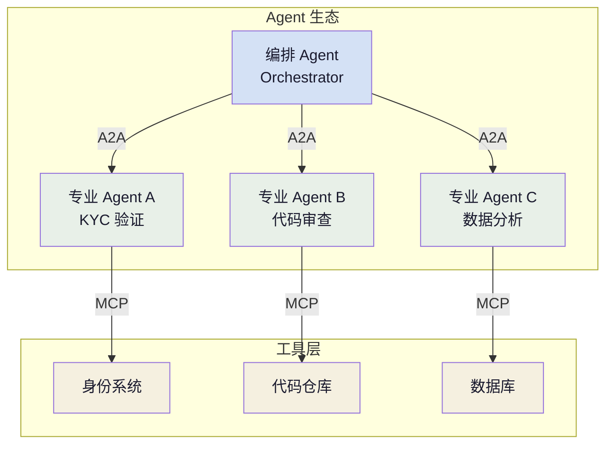

+++
title = "AI 智能体基础（八）：A2A 智能体通信"
slug = "ai-agent-08-a2a"
date = 2026-06-17
categories = ["LLM 基础"]
tags = ["AI 智能体"]
draft = true
showToc = true
TocOpen = true
description = "Agent-to-Agent 协议的完整解析——AgentCard 服务发现机制、Task 状态机模型、与 MCP 的互补关系与分层架构（A2A 编排 × MCP 工具）、以及 2026 年的生态现状。"
+++

前面的七篇都是围绕**单个 Agent**构建的：一个 Agent 具备推理能力、工具调用、记忆系统、知识检索和技能系统。但真实世界的任务常常超越单个 Agent 的能力边界——一个 Agent 不可能同时精通代码审查、KYC 验证、销售分析、网络诊断所有领域。

A2A（Agent-to-Agent Protocol）正是为解决这个问题而生的开放协议，它定义了 Agent 之间如何**发现彼此、委派任务、交换状态**。由 Google 在 2025 年提出，同年与 IBM 的 ACP 合并，2026 年达到 v1.0 并移交 Linux Foundation 治理。

A2A 与第六篇讨论的 MCP 构成了 Agent 通信的两个正交维度：MCP 是**垂直的**——Agent 连接工具；A2A 是**水平的**——Agent 连接 Agent。两者互补，构成完整的 Agent 通信层。

---

## 1. 定义与定位

### 1.1 为什么需要 A2A

在 A2A 之前，让两个 Agent 协作只有两种方式：

| 方式 | 做法 | 问题 |
|:-----|:------|:------|
| **同一个代码库** | 两个 Agent 作为同一应用的不同函数 | 耦合紧密，无法独立部署和更新 |
| **定制 API** | 为每对 Agent 写专门的通信接口 | N 个 Agent 需要 O(N²) 个接口 |

A2A 的定位是成为 Agent 间的**通用语言**——无论两个 Agent 由哪个团队、用哪种框架、部署在何处，只要都实现了 A2A 协议，就能互相通信和协作。

### 1.2 在 Agent 体系中的角色

在本系列的全部组件中，A2A 处于最顶层——它解决的不是单个 Agent 如何工作，而是**多个 Agent 如何协作**：



在典型的三层部署架构中：

```
用户 → Orchestrator Agent（A2A 编排）→ Specialist Agents（MCP 工具）
```

Orchestrator 不直接调用工具——它通过 A2A 将任务委派给 Specialist Agent，后者内部通过 MCP 调用具体的工具系统。

---

## 2. 协议架构

### 2.1 通信模型

A2A 采用 **Peer-to-Peer** 通信模型，Agent 之间是对等关系——没有固定的客户端/服务器之分。一个 Agent 在某个交互中是请求方，在另一个交互中可以是服务方。

完整的 A2A 通信流程分为四个阶段：


| 阶段 | 操作 | 说明 |
|:-----|:------|:------|
| **Phase 1: 发现** | 读取 Agent Card | 通过 `/.well-known/agent-card.json` 获取 Agent 的能力声明 |
| **Phase 2: 提交** | SendMessage | 发起方将任务描述和上下文发给服务方 |
| **Phase 3: 执行** | GetTask / SubscribeToTask | 追踪任务状态变化，支持 Streaming（SSE） |
| **Phase 4: 返回** | Task COMPLETED | 服务方返回结果 Artifacts |

### 2.2 Agent Card：能力发现

每个 A2A 兼容的 Agent 必须暴露一个 Agent Card——一个 JSON 文件，声明 Agent 的元信息、能力和通信接口。Agent Card 位于 HTTP 服务的 `/.well-known/agent-card.json`（遵循 RFC 8615）：

```json
{
    "name": "kyc-verification-agent",
    "description": "验证用户身份的 KYC Agent",
    "version": "1.2.0",
    "agentUrl": "https://kyc.internal.example.com",
    "capabilities": {
        "streaming": true,
        "pushNotifications": false
    },
    "skills": [
        {
            "id": "verify_identity",
            "name": "身份验证",
            "description": "验证用户的身份证件和生物信息",
            "tags": ["kyc", "identity", "compliance"],
            "examples": [
                "验证用户 user_12345 的身份"
            ],
            "inputModes": ["text", "url"],
            "outputModes": ["text", "json"]
        }
    ],
    "securitySchemes": {
        "bearer": {
            "type": "bearer",
            "scheme": "bearer",
            "description": "OAuth 2.0 Bearer Token"
        }
    }
}
```

Agent Card 的三个关键作用：

| 作用 | 说明 |
|:-----|:------|
| **能力声明** | skills 字段告诉编排者"我能做什么" |
| **接口定义** | 通过 `agentUrl` + `supportInterfaces` 告知通信方式 |
| **安全策略** | `securitySchemes` 声明鉴权方式 |

### 2.3 Task 状态机

A2A 协议的核心是一个具有 7 种状态的 Task 状态机，它定义了 Agent 之间如何追踪任务的整个生命周期：

```text
                    ┌─────────┐
                    │SUBMITTED│
                    └────┬────┘
                         │
                    ┌────▼────┐
                    │ WORKING │
                    └┬──┬──┬──┘
                     │  │  │
            ┌────────┘  │  └────────┐
            ▼           │           ▼
     ┌───────────┐      │    ┌───────────┐
     │INPUT_REQ  │      │    │ COMPLETED │
     └─────┬─────┘      │    └─────┬─────┘
           │            │          │
           └────►WORKING│          │
                        │          │
              ┌─────────▼──┐  ┌───▼───────┐
              │  FAILED    │  │  CANCELED │
              └────────────┘  └───────────┘
                        ┌─────────────┐
                        │  REJECTED   │
                        └─────────────┘
```

| 状态 | 含义 | 发起方 |
|:-----|:------|:-------|
| **SUBMITTED** | 任务已提交，等待处理 | 服务方 |
| **WORKING** | 正在执行中 | 服务方 |
| **INPUT_REQUIRED** | 需要更多信息才能继续 | 服务方 → 编排者须回复 |
| **COMPLETED** | 执行成功，结果已就绪 | 服务方 |
| **FAILED** | 执行失败，附错误原因 | 服务方 |
| **CANCELED** | 被发起方取消 | 请求方 |
| **REJECTED** | 服务方拒绝执行（不支持该任务） | 服务方 |

状态机中最关键的路径是 **INPUT_REQUIRED → WORKING** 循环——当 Specialist Agent 发现信息不足时，它可以请求更多输入；编排者提供补充信息后，任务回到 WORKING 状态继续执行。

### 2.4 消息与任务

A2A 的消息模型基于四个核心数据类型：

```text
Message: 消息的原子单位
  └─ role: agent | user   （消息来源）
  └─ parts: TextPart | FilePart | DataPart   （消息内容）

Task: 一个完整的任务单元
  └─ id: string           （全局唯一任务 ID）
  └─ sessionId: string    （会话标识，用于消息关联）
  └─ status: TaskStatus   （当前状态）
  └─ history: Message[]   （该任务的消息历史）
  └─ artifacts: Artifact[]（最终输出，仅 COMPLETED 时存在）

Artifact: 任务的产出的结构化数据
  └─ parts: Part[]
  └─ metadata: dict
```

一个典型的 SendMessage 请求-响应序列：

```json
// 编排者 → Specialist：提交任务
{
    "jsonrpc": "2.0",
    "id": 1,
    "method": "tasks/send",
    "params": {
        "id": "task_20260617_001",
        "sessionId": "sess_abc123",
        "message": {
            "role": "agent",
            "parts": [
                { "type": "text", "text": "验证用户 user_12345 的身份信息" },
                { "type": "text", "text": "用户提交了身份证正反面照片和自拍视频" }
            ]
        }
    }
}

// Specialist → 编排者：任务已接收
{
    "jsonrpc": "2.0",
    "id": 1,
    "result": {
        "id": "task_20260617_001",
        "status": {
            "state": "SUBMITTED",
            "timestamp": "2026-06-17T10:00:00Z"
        }
    }
}

// Specialist 稍后推送状态变更
{
    "jsonrpc": "2.0",
    "method": "task/status_update",
    "params": {
        "id": "task_20260617_001",
        "status": {
            "state": "WORKING",
            "timestamp": "2026-06-17T10:00:05Z"
        }
    }
}

// ... 最终推送完成状态
{
    "jsonrpc": "2.0",
    "method": "task/status_update",
    "params": {
        "id": "task_20260617_001",
        "status": {
            "state": "COMPLETED",
            "timestamp": "2026-06-17T10:00:30Z"
        },
        "artifacts": [{
            "parts": [
                { "type": "text", "text": "身份验证通过" }
            ],
            "metadata": {
                "confidence": 0.97,
                "method": "document_verify + liveness_check"
            }
        }]
    }
}
```

---

## 3. MCP vs A2A：互补的分工

这是 2026 年已经明确的共识——MCP 和 A2A 不是竞争关系，而是同一个通信栈的不同层次：


两者的核心区别可以概括为一句话：**MCP 决定 Agent 如何用工具，A2A 决定 Agent 如何找同伴。**

### 3.1 生产部署的典型架构

2026 年生产环境的推荐架构是一个三層栈：

```text
┌──────────────────────────────────────────────────┐
│                   用户界面                          │
└────────────────────┬─────────────────────────────┘
                     │
┌────────────────────▼─────────────────────────────┐
│            Orchestrator Agent                      │
│  ┌─────────────┐  ┌─────────────┐                │
│  │ 任务分解     │  │ A2A Client  │                │
│  └─────────────┘  └──────┬──────┘                │
└──────────────────────────┼────────────────────────┘
                           │ A2A
        ┌──────────────────┼──────────────────┐
        ▼                  ▼                  ▼
┌───────────────┐  ┌───────────────┐  ┌───────────────┐
│ Specialist A  │  │ Specialist B  │  │ Specialist C  │
│ (KYC Agent)   │  │ (Code Review) │  │ (Data Agent)  │
│               │  │               │  │               │
│  ┌─────────┐  │  │  ┌─────────┐  │  │  ┌─────────┐  │
│  │MCP Clnt │  │  │  │MCP Clnt │  │  │  │MCP Clnt │  │
│  └────┬────┘  │  │  └────┬────┘  │  │  └────┬────┘  │
└───────┼───────┘  └───────┼───────┘  └───────┼───────┘
        │ MCP               │ MCP              │ MCP
        ▼                    ▼                  ▼
  ┌─────────────┐    ┌─────────────┐    ┌─────────────┐
  │ 身份系统     │    │ 代码仓库     │    │ 数据库/API  │
  └─────────────┘    └─────────────┘    └─────────────┘
```

Orchestrator 只做两件事：分解用户请求、通过 A2A 委派子任务。Specialist Agent 只做一件事：接收委派、通过 MCP 调用工具执行、返回结果。

### 3.2 选择指南

| 你在做什么 | 应该用 |
|:-----------|:-------|
| 让 Agent 读文件、查数据库、调用 API | **MCP** |
| 让一个 Agent 把任务交给另一个 Agent | **A2A** |
| 构建多 Agent 协作系统 | 两者都要 |
| 构建单 Agent 工具系统 | MCP 即可 |
| 需要 Agent 在运行时发现可用同伴 | A2A Agent Card |
| 需要 Agent 运行时发现可用工具 | MCP tools/list |

---

## 4. 生态与部署

### 4.1 2026 年的现状

A2A 在 2026 年已经达到 v1.0，治理权已移交 Linux Foundation 下的 LF AI & Data：

- **150+ 组织**支持 A2A（Google / Microsoft / AWS / Salesforce / SAP / PayPal / LangChain）
- **原生集成**：Google Cloud Vertex AI、Azure AI Foundry、Amazon Bedrock AgentCore
- **企业采用**：PayPal 已在生产环境部署 A2A 用于支付工作流
- **SDK 覆盖**：Python、JavaScript、Java、Go、.NET
- **开源**：GitHub 22,000+ stars

### 4.2 最小实现

一个最简单的 A2A 兼容 Specialist Agent 实现：

```python
from fastapi import FastAPI
from pydantic import BaseModel
import uvicorn

# === A2A 数据类型 ===
class Part(BaseModel):
    type: str
    text: str = ""

class Message(BaseModel):
    role: str
    parts: list[Part]

class TaskStatus(BaseModel):
    state: str  # SUBMITTED | WORKING | COMPLETED | FAILED
    timestamp: str

class SendTaskRequest(BaseModel):
    id: str
    sessionId: str
    message: Message

class Task(BaseModel):
    id: str
    status: TaskStatus
    artifacts: list = []

# === A2A Specialist Agent ===
app = FastAPI()

@app.get("/.well-known/agent-card.json")
def get_agent_card():
    """Phase 1: 服务发现 — Agent Card"""
    return {
        "name": "code-review-agent",
        "description": "审查代码质量的 Specialist Agent",
        "version": "1.0.0",
        "agentUrl": "https://code-review.internal.example.com",
        "capabilities": {"streaming": True},
        "skills": [
            {
                "id": "code_review",
                "name": "Code Review",
                "description": "审查指定代码文件的质量",
                "tags": ["code", "review"],
                "examples": ["审查 src/auth/login.ts 的安全性"],
                "inputModes": ["text"],
                "outputModes": ["text", "json"]
            }
        ]
    }

@app.post("/tasks/send")
def send_task(request: SendTaskRequest):
    """Phase 2+3: 接收并执行任务"""
    task_id = request.id

    # 返回接受确认（状态：SUBMITTED）
    # 在实际实现中，这里应该异步执行，这里简化同步处理

    # 提取任务内容
    task_text = request.message.parts[0].text if request.message.parts else ""

    # 执行（同步简化）
    result = execute_code_review(task_text)

    return Task(
        id=task_id,
        status=TaskStatus(state="COMPLETED", timestamp="2026-06-17T10:01:00Z"),
        artifacts=[{"parts": [{"type": "text", "text": result}]}]
    )

def execute_code_review(task: str) -> str:
    """内部逻辑：调用 LLM + 工具完成代码审查"""
    # 实际实现中，这里通过 MCP Client 调用工具
    return f"代码审查完成：{task}"

if __name__ == "__main__":
    uvicorn.run(app, host="0.0.0.0", port=8081)
```

### 4.3 编排者的 A2A Client

Orchestrator Agent 内部的 A2A Client 实现：

```python
import httpx
import json

class A2AClient:
    """A2A 客户端——编排者向 Specialist 提交任务"""

    def __init__(self):
        self.client = httpx.Client()
        self.agent_registry: dict[str, dict] = {}

    def discover_agent(self, agent_url: str) -> dict | None:
        """读取 Agent Card 发现 Agent 能力"""
        try:
            resp = self.client.get(
                f"{agent_url}/.well-known/agent-card.json"
            )
            card = resp.json()
            self.agent_registry[agent_url] = card
            return card
        except Exception as e:
            print(f"Discovery failed for {agent_url}: {e}")
            return None

    def find_agent_by_skill(self, skill_tag: str) -> list[dict]:
        """按技能查找 Agent"""
        matches = []
        for url, card in self.agent_registry.items():
            for skill in card.get("skills", []):
                if skill_tag in skill.get("tags", []):
                    matches.append({"url": url, "skill": skill})
        return matches

    def send_task(self, agent_url: str, task_id: str,
                  text: str) -> dict | None:
        """向 Specialist Agent 提交任务"""
        payload = {
            "jsonrpc": "2.0",
            "id": 1,
            "method": "tasks/send",
            "params": {
                "id": task_id,
                "sessionId": f"session_{task_id}",
                "message": {
                    "role": "agent",
                    "parts": [{"type": "text", "text": text}]
                }
            }
        }
        try:
            resp = self.client.post(
                f"{agent_url}/tasks/send",
                json=payload
            )
            return resp.json()
        except Exception as e:
            print(f"Task submission failed: {e}")
            return None
```

---

## 5. 设计原则

### 5.1 任务粒度

A2A 任务的设计与第七篇讨论的技能粒度原则一致——任务不宜过细也不宜过粗：

| 粒度 | 示例 | 问题 |
|:-----|:------|:------|
| **过细** | "帮我执行这个 grep 命令" | 通信开销超过执行收益 |
| **适中** | "审查 src/auth/login.ts 的安全性" | 收益明确，边界清晰 |
| **过粗** | "审查整个项目" | 任务量超出单个 Specialist 能力边界，内部隐式依赖过多 |

**经验规则**：A2A 任务应该对应一个完整的、边界清晰的**子问题**。如果编排者还需要想"怎么拆给多个 Specialist"，说明还需要再拆一层。

### 5.2 INPUT_REQUIRED 的生命力

INPUT_REQUIRED 是 A2A 状态机中最容易被忽视但最有价值的状态。它允许 Specialist Agent 在信息不足时**主动向编排者请求补充信息**，而不必猜测或失败：

```text
编排者: "验证用户 user_12345"
Specialist: (检查数据库发现 user_12345 没有提交护照照片)
         → INPUT_REQUIRED: "需要用户上传护照照片"
编排者: (通知用户 → 用户上传) → "护照照片已上传至 file:///uploads/passport.jpg"
Specialist: 收到 → WORKING → COMPLETED
```

这个模式的价值在于：**Specialist Agent 知道自己缺什么，编排者不需要预判所有可能的信息缺口。**

---

## 核心概念速查

| 概念 | 定义 | 关键约束 |
|:----:|:------|:---------|
| A2A | Agent-to-Agent Protocol，Agent 间通信的开放标准 | 基于 JSON-RPC 2.0，v1.0 Linux Foundation 治理 |
| Agent Card | `/.well-known/agent-card.json`，Agent 的能力声明 | 包含 skills、capabilities、securitySchemes |
| Task 状态机 | 7 种状态定义任务生命周期 | SUBMITTED → WORKING → (COMPLETED / FAILED / CANCELED / REJECTED) |
| INPUT_REQUIRED | Agent 主动请求补充信息的状态 | 不会导致任务失败，回到 WORKING 继续 |
| SendMessage | 提交任务到 Specialist Agent | 包含 role + parts（text / file / data） |
| Artifact | 任务的最终产出 | 仅 COMPLETED 状态时存在 |
| MCP vs A2A | MCP 垂直（Agent→工具），A2A 水平（Agent↔Agent） | 互补而非竞争，生产环境两者组合 |
| 三層架构 | A2A（Agent 间）→ MCP（Agent 连接工具） | Orchestrator 通过 A2A 委派，Specialist 通过 MCP 执行 |
